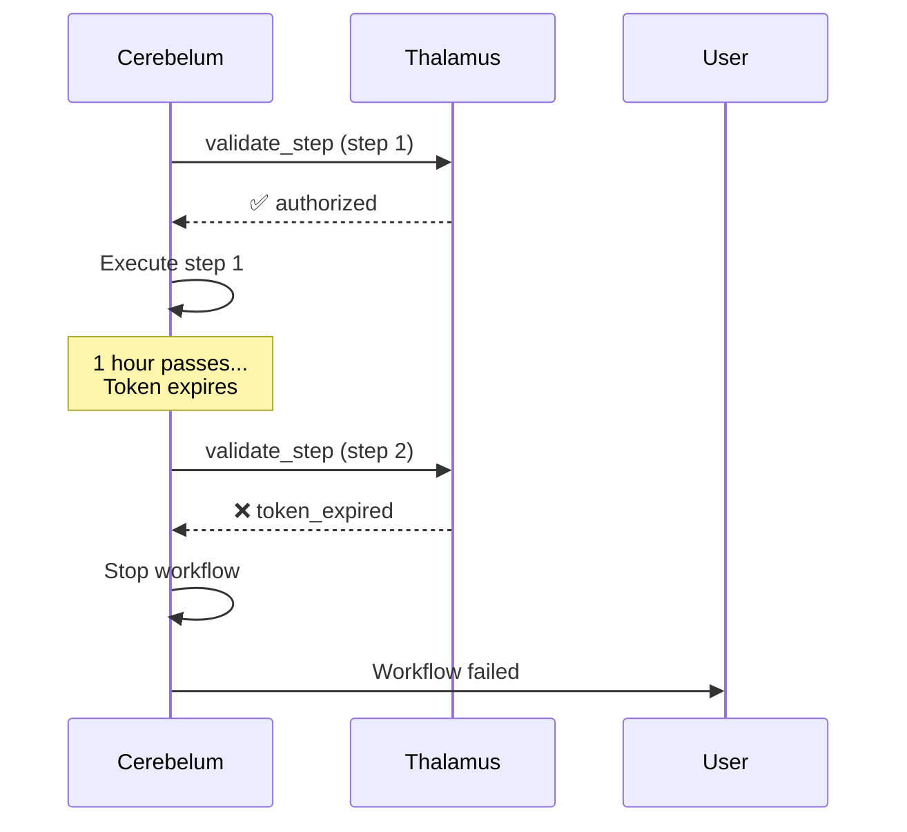
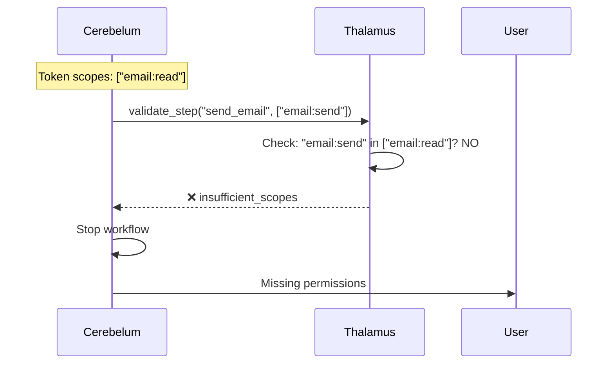
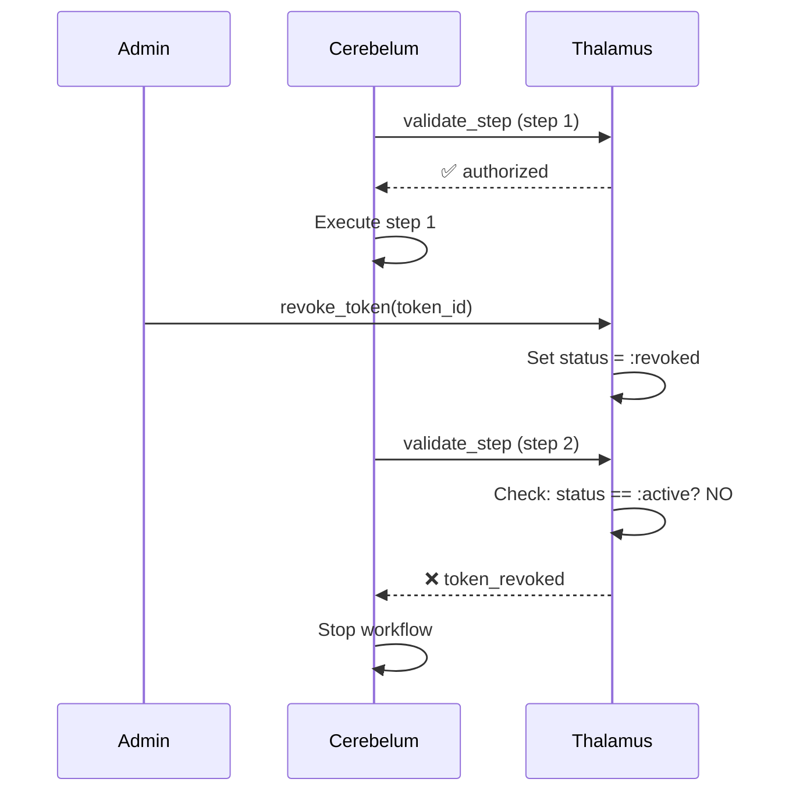

# Step Authorization Sequence Diagram

## Overview

This diagram shows the detailed flow of how Cerebelum validates agent authorization before executing each workflow step.

## Sequence Diagram (Mermaid)

```mermaid
sequenceDiagram
    participant User
    participant Cerebelum as Cerebelum<br/>(Workflow Engine)
    participant API as Thalamus.API<br/>(Facade)
    participant UseCase as ValidateStepAuthorization<br/>(Use Case)
    participant Repo as AgentTokenRepository<br/>(Infrastructure)
    participant Audit as AuditLogger<br/>(Infrastructure)
    participant DB as PostgreSQL

    %% Workflow Start
    User->>Cerebelum: Trigger workflow execution
    activate Cerebelum

    Note over Cerebelum: Workflow already has<br/>agent token from<br/>initial setup

    %% Loop for each step
    loop For each workflow step

        %% Step 1: Validate Authorization
        Cerebelum->>API: validate_step(token, step_name, scopes, context)
        activate API

        API->>UseCase: execute(request, deps)
        activate UseCase

        %% Step 2: Find Token
        UseCase->>Repo: find_by_access_token(token)
        activate Repo
        Repo->>DB: SELECT * FROM tokens WHERE access_token = ?
        activate DB
        DB-->>Repo: token record
        deactivate DB
        Repo-->>UseCase: {:ok, agent_token}
        deactivate Repo

        %% Step 3: Validate Token
        UseCase->>UseCase: validate_not_expired(token)
        Note over UseCase: Check: created_at + expires_in > now()

        UseCase->>UseCase: validate_not_revoked(token)
        Note over UseCase: Check: status == :active

        UseCase->>UseCase: validate_has_scopes(token, required_scopes)
        Note over UseCase: Check: required_scopes ⊆ token.scopes

        %% Step 4: Log Decision (Granted)
        alt Authorization Granted
            UseCase->>Audit: log(step_authorization.granted)
            activate Audit
            Audit->>DB: INSERT INTO audit_logs (...)
            activate DB
            DB-->>Audit: ok
            deactivate DB
            Audit-->>UseCase: :ok
            deactivate Audit

            UseCase-->>API: {:ok, %{authorized: true, scopes: [...]}}
            deactivate UseCase
            API-->>Cerebelum: {:ok, auth_result}
            deactivate API

            %% Step 5: Execute Step
            Cerebelum->>Cerebelum: execute_step()
            Note over Cerebelum: Perform actual<br/>workflow action<br/>(send email, etc.)

        else Authorization Denied
            UseCase->>Audit: log(step_authorization.denied, reason)
            activate Audit
            Audit->>DB: INSERT INTO audit_logs (...)
            activate DB
            DB-->>Audit: ok
            deactivate DB
            Audit-->>UseCase: :ok
            deactivate Audit

            UseCase-->>API: {:error, reason}
            deactivate UseCase
            API-->>Cerebelum: {:error, reason}
            deactivate API

            %% Stop workflow execution
            Cerebelum->>User: Workflow failed:<br/>Authorization denied
            Note over Cerebelum: Workflow stopped,<br/>no further steps executed
        end
    end

    deactivate Cerebelum
```

## Flow Steps Explained

### 1. Workflow Trigger
- User initiates workflow execution
- Cerebelum already has agent token (generated at workflow setup)

### 2. Pre-Step Validation (CRITICAL)
Before executing EACH step, Cerebelum calls `Thalamus.API.validate_step()`:
```elixir
{:ok, auth_result} = Thalamus.API.validate_step(
  workflow_token,
  "send_email_step",
  ["email:send"],
  %{workflow_id: "wf_123", step_index: 3}
)
```

### 3. Token Lookup
- UseCase calls `AgentTokenRepository.find_by_access_token(token)`
- Repository queries PostgreSQL for token record
- Returns full `AgentToken` entity

### 4. Token Validation (3 Checks)

#### 4.1 Expiration Check
```elixir
expires_at = DateTime.add(token.created_at, token.expires_in, :second)
DateTime.compare(expires_at, DateTime.utc_now()) == :gt
```

#### 4.2 Revocation Check
```elixir
token.status == :active
```

#### 4.3 Scope Check
```elixir
MapSet.subset?(
  MapSet.new(required_scopes),
  MapSet.new(token.scopes)
)
```

### 5. Audit Logging
Every authorization decision is logged:

**Granted**:
```json
{
  "event_type": "step_authorization.granted",
  "actor_id": "agt_abc123",
  "resource_type": "workflow_step",
  "resource_id": "send_email_step",
  "metadata": {
    "decision": "granted",
    "scopes": ["email:send"],
    "workflow_id": "wf_123",
    "step_index": 3
  }
}
```

**Denied**:
```json
{
  "event_type": "step_authorization.denied",
  "actor_id": "agt_abc123",
  "resource_type": "workflow_step",
  "resource_id": "send_email_step",
  "metadata": {
    "decision": "denied",
    "reason": "token_expired",
    "scopes": ["email:send"],
    "workflow_id": "wf_123",
    "step_index": 3
  }
}
```

### 6. Step Execution or Failure
- **If authorized**: Cerebelum executes the step
- **If denied**: Cerebelum stops workflow and notifies user

## Error Scenarios

### Scenario 1: Token Expired Mid-Workflow



**Resolution**: Workflow should regenerate token or have longer TTL.

### Scenario 2: Insufficient Scopes



**Resolution**: Request token with broader scopes at workflow start.

### Scenario 3: Token Revoked



**Resolution**: Admin revoked for security reasons, workflow cannot continue.

## Performance Considerations

### Database Queries Per Step
- 1 SELECT query (find token)
- 1 INSERT query (audit log)

### Optimization Opportunities
1. **Caching**: Cache active tokens in Redis (TTL-aware)
2. **Batch Validation**: Validate multiple steps at once
3. **Async Audit**: Log asynchronously to avoid blocking

### Current Performance
- **Latency**: ~10-20ms per validation (DB lookup + checks)
- **Throughput**: 1000+ validations/second (single node)

## Security Properties

### Defense in Depth
1. ✅ Token must exist in database
2. ✅ Token must not be expired
3. ✅ Token must not be revoked
4. ✅ Token must have required scopes
5. ✅ All decisions are audited
6. ✅ Organization isolation enforced

### Compliance
- **SOC 2**: All authorization events logged
- **GDPR**: User can revoke agent permissions
- **HIPAA**: Audit trail for all data access

## Testing the Flow

```elixir
# In tests, mock the repository
MockAgentTokenRepository
|> expect(:find_by_access_token, fn "at_valid_token" ->
  {:ok, %AgentToken{
    status: :active,
    scopes: ["email:send", "reports:read"],
    created_at: DateTime.utc_now(),
    expires_in: 3600
  }}
end)

# Validate authorization
assert {:ok, %{authorized: true}} =
  Thalamus.API.validate_step("at_valid_token", "send_email", ["email:send"])
```

## Related Documentation

- [Cerebelum Integration Guide](../CEREBELUM_INTEGRATION.md)
- [Agent Token Technical Spec](../AGENT_TOKEN_TECHNICAL_SPEC.md)
- [Audit Logging](../AUDIT_LOGGING.md)
