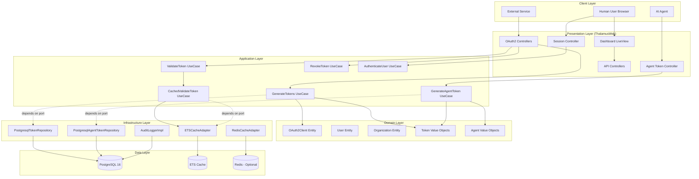
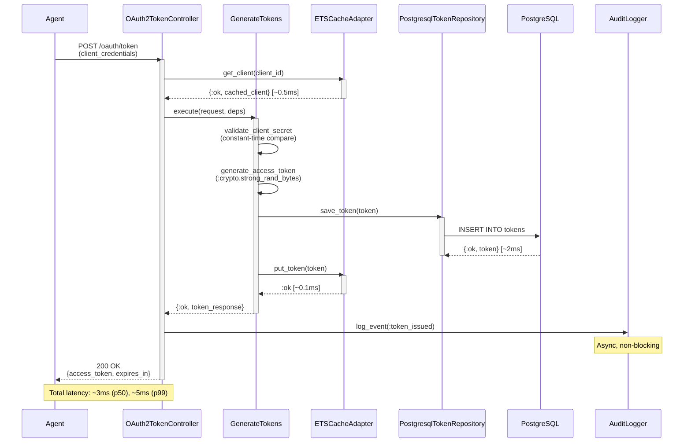
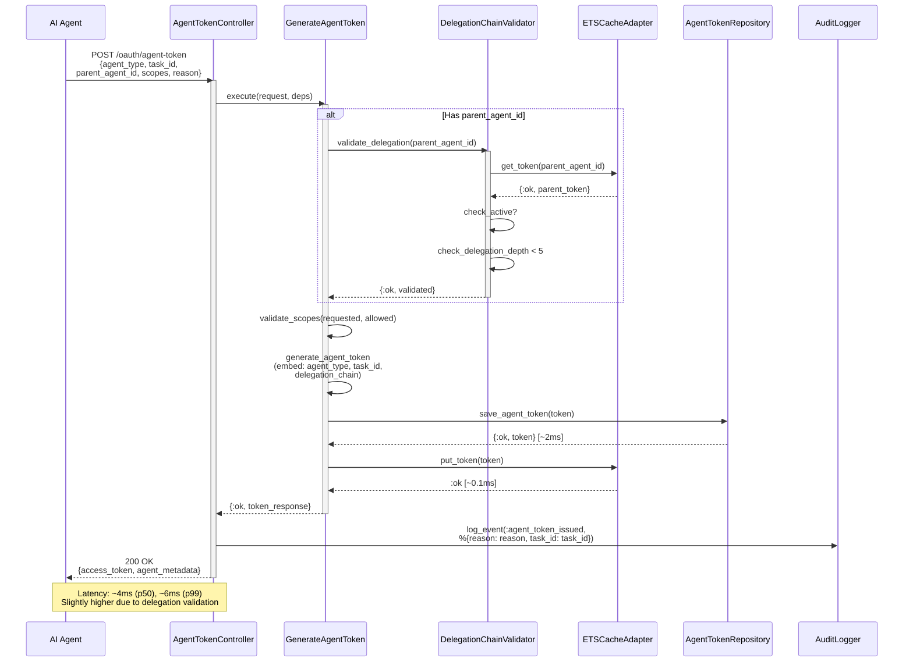
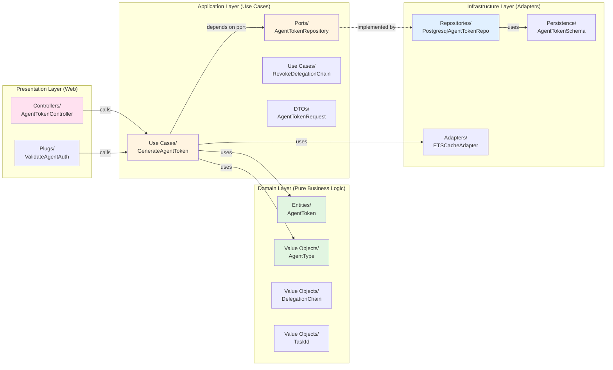
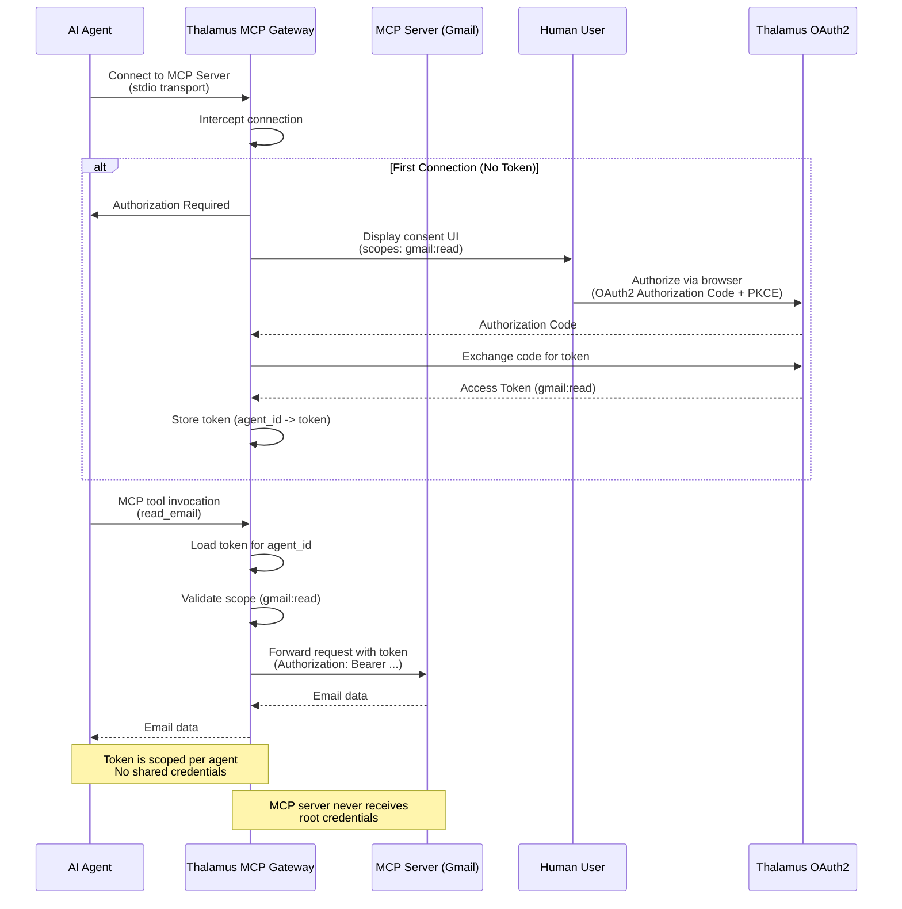

# System Architecture
## Thalamus: Identity Server for the Agentic Economy

[← Back to Index](02-design-index.md)

---

## 1. High-Level Architecture

---

## 2. Request Flow: M2M Token Generation (<5ms p99)

---

## 3. Request Flow: Agent Token with Delegation Chain

---

## 4. Clean Architecture Layer Mapping

---

## 5. MCP Gateway Architecture

### 5.1 MCP Gateway Flow (Confused Deputy Protection)

---

[← Back to Index](02-design-index.md) | [Next: Components →](02-design-components.md)
