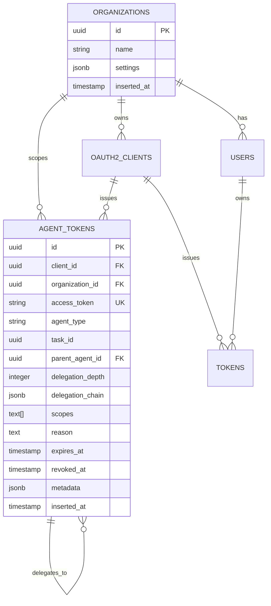

# Database Design
## Thalamus: Identity Server for the Agentic Economy

[← Back to Index](02-design-index.md)

---

## Entity-Relationship Diagram



---

## Database Migration (Additive-Only)

**Migration:** `20260116_add_agent_tokens_table.exs`

```sql
CREATE TABLE agent_tokens (
  id UUID PRIMARY KEY DEFAULT gen_random_uuid(),
  client_id UUID NOT NULL REFERENCES oauth2_clients(id) ON DELETE CASCADE,
  organization_id UUID NOT NULL REFERENCES organizations(id) ON DELETE CASCADE,
  access_token TEXT NOT NULL UNIQUE,
  agent_type VARCHAR(50) NOT NULL CHECK (agent_type IN ('autonomous', 'supervisor', 'tool')),
  task_id UUID NOT NULL,
  parent_agent_id UUID REFERENCES agent_tokens(id) ON DELETE SET NULL,
  delegation_depth INTEGER NOT NULL DEFAULT 0 CHECK (delegation_depth >= 0 AND delegation_depth < 5),
  delegation_chain JSONB,
  scopes TEXT[] NOT NULL DEFAULT '{}',
  reason TEXT,
  expires_at TIMESTAMP NOT NULL,
  revoked_at TIMESTAMP,
  metadata JSONB DEFAULT '{}',
  inserted_at TIMESTAMP NOT NULL DEFAULT NOW()
);

-- Performance Indexes
CREATE INDEX idx_agent_tokens_access_token ON agent_tokens(access_token) WHERE revoked_at IS NULL;
CREATE INDEX idx_agent_tokens_organization_id ON agent_tokens(organization_id);
CREATE INDEX idx_agent_tokens_parent_agent_id ON agent_tokens(parent_agent_id) WHERE parent_agent_id IS NOT NULL;
CREATE INDEX idx_agent_tokens_task_id ON agent_tokens(task_id);
CREATE INDEX idx_agent_tokens_expires_at ON agent_tokens(expires_at) WHERE revoked_at IS NULL;

-- GIN index for JSONB delegation_chain queries
CREATE INDEX idx_agent_tokens_delegation_chain ON agent_tokens USING GIN (delegation_chain);

-- Partial index for active tokens only (performance optimization)
CREATE INDEX idx_agent_tokens_active ON agent_tokens(client_id, organization_id)
  WHERE revoked_at IS NULL AND expires_at > NOW();
```

**Key Design Decisions:**
- ✅ **No changes to existing tables** - Backward compatibility guaranteed
- ✅ **Partial indexes** - Only index active, non-revoked tokens for performance
- ✅ **GIN index on JSONB** - Fast delegation chain queries
- ✅ **Check constraints** - Enforce delegation depth < 5 at database level

---

## Multi-Tenant Isolation

### Row-Level Security (RLS)

```sql
-- Enable RLS for organization isolation
ALTER TABLE agent_tokens ENABLE ROW LEVEL SECURITY;

CREATE POLICY agent_tokens_isolation ON agent_tokens
  USING (organization_id = current_setting('app.current_organization_id')::uuid);
```

### Application-Level Filtering

```elixir
# Set organization_id per session
defmodule ThalamusWeb.Plugs.SetOrganizationContext do
  def call(conn, _opts) do
    organization_id = get_organization_id(conn)

    Repo.query("SET app.current_organization_id = $1", [organization_id])

    conn
  end
end
```

### Query Examples

```elixir
# All queries automatically filtered by organization_id via RLS
Repo.all(AgentToken)  # Only returns tokens for current organization

# Explicit filtering (defense in depth)
from t in AgentToken,
  where: t.organization_id == ^organization_id,
  where: is_nil(t.revoked_at),
  where: t.expires_at > ^DateTime.utc_now()
```

---

## Performance Optimization

### Query Patterns

**Token Lookup (Hot Path - <3ms p99):**
```sql
-- Uses idx_agent_tokens_access_token (partial index on active tokens)
SELECT * FROM agent_tokens
WHERE access_token = $1
  AND revoked_at IS NULL
  AND expires_at > NOW();
```

**Delegation Chain Revocation:**
```sql
-- Uses GIN index on delegation_chain JSONB
UPDATE agent_tokens
SET revoked_at = NOW()
WHERE delegation_chain->>'parent_token_id' = $1
  AND revoked_at IS NULL;
```

### Expected Query Performance

| Query Type | Index Used | Expected Latency |
|-----------|-----------|-----------------|
| Token lookup by access_token | Partial B-tree | <2ms |
| Find by organization_id | B-tree | <3ms |
| Revoke delegation chain | GIN (JSONB) | <5ms |
| List active tokens | Partial composite | <10ms |

---

[← Back to Index](02-design-index.md) | [Next: Performance →](02-design-performance.md)
