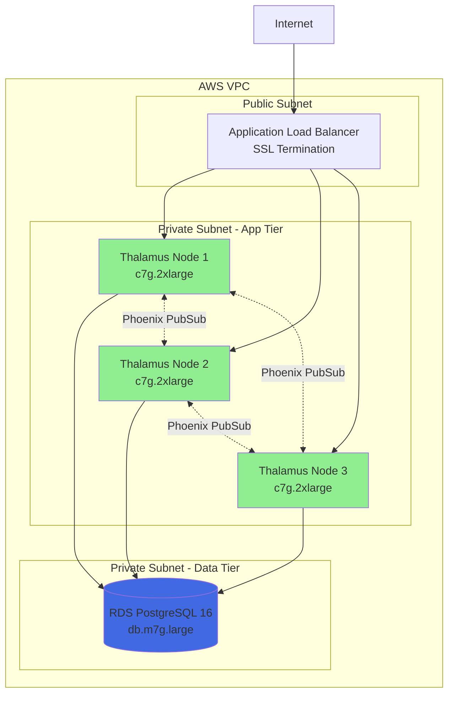
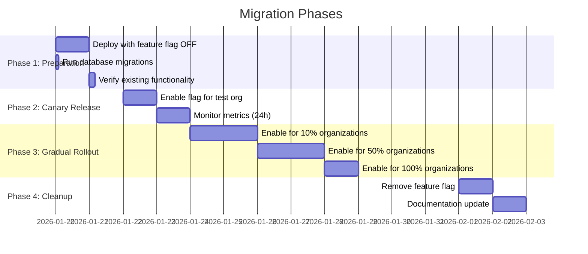

# Deployment & Operations
## Thalamus: Identity Server for the Agentic Economy

[← Back to Index](02-design-index.md)

---

## Production Infrastructure (AWS Graviton)



---

## Cost Breakdown (10M tokens/month)

| Component | Instance Type | Monthly Cost | Notes |
|-----------|--------------|--------------|-------|
| Thalamus Nodes (3x) | c7g.2xlarge | $195 | ARM64, 8 vCPU each |
| PostgreSQL RDS | db.m7g.large | $120 | 2 vCPU, 8GB RAM |
| Application Load Balancer | - | $18 | Standard ALB |
| Data Transfer | - | ~$10 | Minimal (mostly internal) |
| **TOTAL** | | **$343/month** | vs $10k-$50k competitors |

**Redis Eliminated** - Saves $50-200/month by using ETS instead.

### Scaling Strategy

| Load Level | Configuration | Cost/Month | Notes |
|------------|--------------|------------|-------|
| Development | 1x c7g.large | $60 | Single node |
| Production (0-1M req/day) | 2x c7g.2xlarge + db.m7g.large | $250 | High availability |
| Production (1M-10M req/day) | 3x c7g.2xlarge + db.m7g.large | $343 | Current target |
| Production (10M+ req/day) | 5x c7g.2xlarge + db.m7g.xlarge | $600 | Enterprise scale |

**Horizontal Scaling** - Add nodes without Redis dependency. ETS cache is node-local.

---

## Migration Path from v1.0.0-rc1 to Agentic Version

### Zero-Downtime Migration Strategy



### Feature Flag Implementation

```elixir
defmodule Thalamus.FeatureFlags do
  def agent_tokens_enabled?(organization_id) do
    # Check environment variable first (global override)
    global_enabled = System.get_env("ENABLE_AGENT_TOKENS", "false") == "true"

    if global_enabled do
      true
    else
      # Check per-organization setting
      case Thalamus.Repo.get_by(Organization, id: organization_id) do
        %{settings: %{"enable_agent_tokens" => true}} -> true
        _ -> false
      end
    end
  end
end

# Usage in controller
def create(conn, params) do
  organization_id = get_organization_id(conn)

  if FeatureFlags.agent_tokens_enabled?(organization_id) do
    GenerateAgentToken.execute(request, @deps)
  else
    GenerateTokens.execute(request, @deps)  # Fallback
  end
end
```

### Rollback Plan

If critical issues are detected:

1. **Immediate**: Set `ENABLE_AGENT_TOKENS=false` (disables for all orgs)
2. **Targeted**: Disable per-organization via database update
3. **Full Rollback**: Revert to previous release (migrations are additive, safe to keep)

```bash
# Emergency disable via environment variable
kubectl set env deployment/thalamus ENABLE_AGENT_TOKENS=false

# Or via database for specific org
psql> UPDATE organizations SET settings = settings || '{"enable_agent_tokens": false}' WHERE id = '...';
```

---

## SDK Architecture

### Python SDK Design

```python
from typing import Optional, List
import httpx
from dataclasses import dataclass

@dataclass
class AgentTokenRequest:
    agent_type: str  # autonomous, supervisor, tool
    task_id: str
    scopes: List[str]
    reason: Optional[str] = None
    parent_agent_id: Optional[str] = None

class ThalamusClient:
    def __init__(self, auth_url: str, client_id: str, client_secret: str, timeout: float = 10.0):
        self.auth_url = auth_url
        self.client_id = client_id
        self.client_secret = client_secret
        self._http_client = httpx.AsyncClient(timeout=timeout)

    async def get_agent_token(
        self,
        agent_type: str,
        task_id: str,
        scopes: List[str],
        reason: Optional[str] = None,
        parent_agent_id: Optional[str] = None
    ) -> str:
        """Request an ephemeral agent token."""
        response = await self._http_client.post(
            f"{self.auth_url}/oauth/agent-token",
            json={
                "agent_type": agent_type,
                "task_id": task_id,
                "scopes": scopes,
                "reason": reason,
                "parent_agent_id": parent_agent_id
            },
            auth=(self.client_id, self.client_secret)
        )

        if response.status_code == 200:
            return response.json()["access_token"]
        else:
            raise ThalamusError.from_response(response)
```

### SDK Feature Matrix

| Feature | Python | TypeScript | Go | Rust | Java | Kotlin |
|---------|--------|-----------|----|----|------|---------|
| Sync Client | ✅ | ✅ | ✅ | ✅ | ✅ | ✅ |
| Async Client | ✅ | ✅ | ✅ | ✅ | ❌ | ✅ |
| Token Caching | ✅ | ✅ | ✅ | ✅ | ✅ | ✅ |
| Auto Retry w/ Backoff | ✅ | ✅ | ✅ | ✅ | ✅ | ✅ |
| Type Hints/Annotations | ✅ | ✅ | ✅ | ✅ | ✅ | ✅ |
| Error Hierarchy | ✅ | ✅ | ✅ | ✅ | ✅ | ✅ |
| MCP Gateway Support | 🟡 (v2) | 🟡 (v2) | 🟡 (v2) | 🟡 (v2) | 🟡 (v2) | 🟡 (v2) |

---

## Security Considerations

### Threat Model

| Threat | Mitigation | Priority |
|--------|-----------|----------|
| **Prompt Injection via `reason` field** | Sanitize natural language input, log suspicious patterns | HIGH |
| **Delegation Chain Exploitation** | Max depth 5, validate parent token active, cascade revocation | CRITICAL |
| **Token Theft from MCP Servers** | MCP Gateway isolates tokens, no static credentials | CRITICAL |
| **Timing Attacks on token validation** | Constant-time comparison (`Plug.Crypto.secure_compare`) | HIGH |
| **SQL Injection** | Parameterized queries only (Ecto enforces) | CRITICAL |
| **Replay Attacks** | Short-lived tokens (5min default), nonce validation | MEDIUM |
| **Confused Deputy (MCP)** | Scoped tokens per agent, OAuth2 consent flow | CRITICAL |

### Cryptographic Standards

```elixir
# Token Generation (Cryptographically Secure)
:crypto.strong_rand_bytes(32) |> Base.url_encode64(padding: false)

# JWT Signing (Asymmetric Keys)
{:ok, token, _claims} = Joken.encode_and_sign(claims, signer)
# Signer uses RS256 (2048-bit RSA) or ES256 (ECDSA P-256)

# Password Hashing (Bcrypt)
Bcrypt.hash_pwd_salt(password, rounds: 12)

# Constant-Time Comparison
Plug.Crypto.secure_compare(token1, token2)
```

### Rate Limiting per Client

```elixir
defmodule ThalamusWeb.Plugs.RateLimiter do
  import Plug.Conn

  @limit 1_000  # requests per minute

  def call(conn, _opts) do
    client_id = get_client_id(conn)

    case Hammer.check_rate("token_generation:#{client_id}", 60_000, @limit) do
      {:allow, _count} -> conn
      {:deny, limit} ->
        conn
        |> put_status(:too_many_requests)
        |> put_resp_header("retry-after", "60")
        |> json(%{error: %{code: "rate_limit_exceeded"}})
        |> halt()
    end
  end
end
```

---

## Open Questions

1. **MCP Gateway Transport**: WebSocket support or stdio-only for MVP?
2. **Agent Token TTL**: Default 5 minutes, configurable per client?
3. **Delegation Chain Visualization**: Tree view in dashboard (defer to v1.1)?
4. **AAuth Approval UI**: Custom LiveView or integrate with existing dashboard?
5. **SDK Priority**: Which SDK after Python? (Recommendation: TypeScript)

---

[← Back to Index](02-design-index.md)

**Next Steps:**
1. Review and approve all design documents
2. Address pending design decisions above
3. Proceed to Phase 3: Tasks (Implementation Plan with checkboxes)
