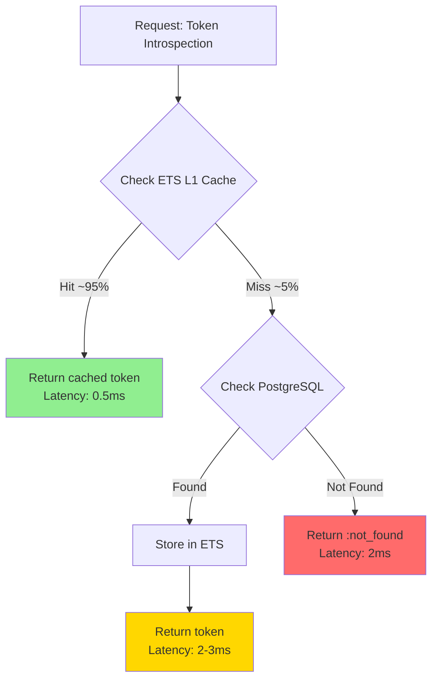

# Performance & Testing
## Thalamus: Identity Server for the Agentic Economy

[← Back to Index](02-design-index.md)

---

## Performance Optimization Strategies

### ETS vs Redis Latency Comparison

| Operation | Redis (Network) | ETS (In-Memory) | Improvement |
|-----------|----------------|-----------------|-------------|
| Token Lookup (cache hit) | ~3ms | ~0.5ms | **6x faster** |
| Token Storage | ~2ms | ~0.1ms | **20x faster** |
| Bulk Invalidation (100 keys) | ~50ms | ~5ms | **10x faster** |

**ETS Configuration for Maximum Performance:**
```elixir
:ets.new(:thalamus_token_cache, [
  :named_table,
  :set,                    # Hash table for O(1) lookups
  :public,                 # Allow all processes to read
  read_concurrency: true,  # Optimize for concurrent reads
  write_concurrency: true, # Optimize for concurrent writes
  decentralized_counters: true  # Reduce contention on OTP 26+
])
```

### Database Connection Pooling Strategy

```elixir
# config/runtime.exs
config :thalamus, Thalamus.Repo,
  pool_size: String.to_integer(System.get_env("DB_POOL_SIZE") || "50"),
  queue_target: 500,        # Queue requests if pool saturated for 500ms
  queue_interval: 1000,     # Check queue every 1s
  timeout: 15_000,          # Query timeout
  pool: DBConnection.ConnectionPool

# Separate pool for audit logs (non-blocking writes)
config :thalamus, Thalamus.AuditLogRepo,
  pool_size: 10,            # Smaller pool for async writes
  queue_target: 5000,       # Allow longer queuing
  timeout: 30_000
```

### BEAM Process Isolation for <5ms Latency

**Key BEAM Properties Exploited:**
1. **Lightweight Processes**: Each request runs in isolated process (~1KB memory)
2. **Per-Process GC**: No "Stop-the-World" pauses affecting other requests
3. **Preemptive Scheduling**: Fair scheduling prevents blocking
4. **Share-Nothing Architecture**: No mutex contention between requests

### Three-Tier Caching Strategy



**Cache Invalidation Strategy:**
```elixir
# Invalidate locally + broadcast to all nodes via Phoenix.PubSub
def invalidate_token(token_id) do
  ETSCacheAdapter.invalidate(token_id)
  Phoenix.PubSub.broadcast(Thalamus.PubSub, "cache:invalidation", {:invalidate_token, token_id})
end
```

---

## Error Handling and Resilience

### Stripe-Level Error Messages

```json
{
  "error": {
    "code": "max_delegation_depth_exceeded",
    "message": "Delegation chain cannot exceed 5 levels. Current depth: 5, parent: agent_abc123",
    "documentation_url": "https://docs.thalamus.io/errors/delegation_depth",
    "request_id": "req_2026011612345",
    "timestamp": "2026-01-16T23:45:00Z",
    "details": {
      "current_depth": 5,
      "max_depth": 5,
      "parent_agent_id": "agent_abc123"
    }
  }
}
```

### Graceful Degradation Strategy

| Component Failure | Degradation Strategy | User Impact |
|------------------|---------------------|-------------|
| PostgreSQL down | Return HTTP 503, retry with exponential backoff | Temporary unavailability |
| ETS cache miss | Fall back to PostgreSQL lookup (slower) | Increased latency (~3ms to ~10ms) |
| Audit log failure | Log to stderr, continue token generation | No user impact (async logging) |
| PubSub failure | Cache invalidation becomes eventual consistency | Stale cache for <60s (TTL) |
| Parent token lookup fails | Reject delegation, allow root token generation | Agent can still authenticate |

---

## Testing Strategy

### Test Pyramid

| Layer | Test Type | Coverage Target | Example |
|-------|-----------|----------------|---------|
| Domain | Pure unit tests (no mocks) | 100% | `AgentType.new("autonomous")` returns `{:ok, %AgentType{}}` |
| Application | Use case tests with Mox | 90% | `GenerateAgentToken.execute/2` with mocked repos |
| Infrastructure | Integration tests with DB | 80% | `PostgresqlAgentTokenRepository.save/1` with real DB |
| Web | Controller tests with ConnCase | 85% | `POST /oauth/agent-token` returns 200 OK |
| E2E | Full flow tests | Manual only | Agent requests token -> uses token -> revoke -> verify |

### Performance Benchmarking

```elixir
defmodule Thalamus.Performance.TokenGenerationBenchmark do
  use ExUnit.Case

  @tag :benchmark
  test "M2M token generation completes in <5ms p99" do
    # Generate 10,000 tokens and measure latency
    latencies =
      1..10_000
      |> Task.async_stream(fn _ ->
        measure_latency(fn -> GenerateTokens.execute(build_request(), @deps) end)
      end, max_concurrency: 100)
      |> Enum.map(fn {:ok, latency} -> latency end)
      |> Enum.sort()

    p50 = Enum.at(latencies, 5_000)
    p95 = Enum.at(latencies, 9_500)
    p99 = Enum.at(latencies, 9_900)

    assert p50 < 2.0, "p50 latency: #{p50}ms (expected < 2ms)"
    assert p95 < 4.0, "p95 latency: #{p95}ms (expected < 4ms)"
    assert p99 < 5.0, "p99 latency: #{p99}ms (expected < 5ms)"
  end
end
```

### Load Testing with K6

```javascript
// k6-load-test.js
import http from 'k6/http';
import { check } from 'k6';

export let options = {
  stages: [
    { duration: '1m', target: 1000 },   // Ramp up to 1k RPS
    { duration: '5m', target: 10000 },  // Sustain 10k RPS
    { duration: '1m', target: 0 },      // Ramp down
  ],
  thresholds: {
    'http_req_duration{p(99)}': ['value<5'],  // p99 < 5ms
    'http_req_duration{p(95)}': ['value<4'],  // p95 < 4ms
    'http_req_failed': ['rate<0.01'],         // Error rate < 1%
  },
};

export default function () {
  const payload = JSON.stringify({
    grant_type: 'client_credentials',
    client_id: __ENV.CLIENT_ID,
    client_secret: __ENV.CLIENT_SECRET,
  });

  const res = http.post('http://localhost:4000/oauth/token', payload, {
    headers: { 'Content-Type': 'application/json' },
  });

  check(res, {
    'status is 200': (r) => r.status === 200,
    'has access_token': (r) => JSON.parse(r.body).access_token !== undefined,
    'latency < 5ms': (r) => r.timings.duration < 5,
  });
}
```

---

## Observability and Monitoring

### Prometheus Metrics

```elixir
# Exposed metrics:
# - thalamus_token_generation_duration_milliseconds (histogram)
# - thalamus_token_introspection_duration_milliseconds (histogram)
# - thalamus_cache_hit_rate (gauge)
# - thalamus_active_tokens_count (gauge)
# - thalamus_agent_tokens_issued_total (counter)
# - thalamus_delegation_chain_depth (histogram)
```

### Grafana Dashboard Layout

**Thalamus - Agentic Identity Server Dashboard**

**Row 1: Latency Percentiles (Last 1 Hour)**
- p50: 1.8ms
- p95: 3.2ms
- p99: 4.5ms

**Row 2:**
- **Request Rate**: 8,432 req/s [Graph showing RPS trend]
- **Error Rate**: 0.05% (4xx+5xx) [Graph showing errors]

**Row 3:**
- **Cache Performance**: Hit Rate 96.3%, Avg Delegation Depth 2.1 levels
- **Agent Token Activity**: 4,231 active agents, 1,892 with delegation

**Row 4:**
- **Database Connection Pool**: Active 23/50, Queue 0
- **BEAM VM Health**: 12,441 processes, 2.3 GB memory

---

[← Back to Index](02-design-index.md) | [Next: Deployment →](02-design-deployment.md)
