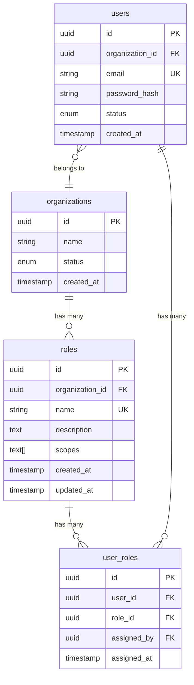
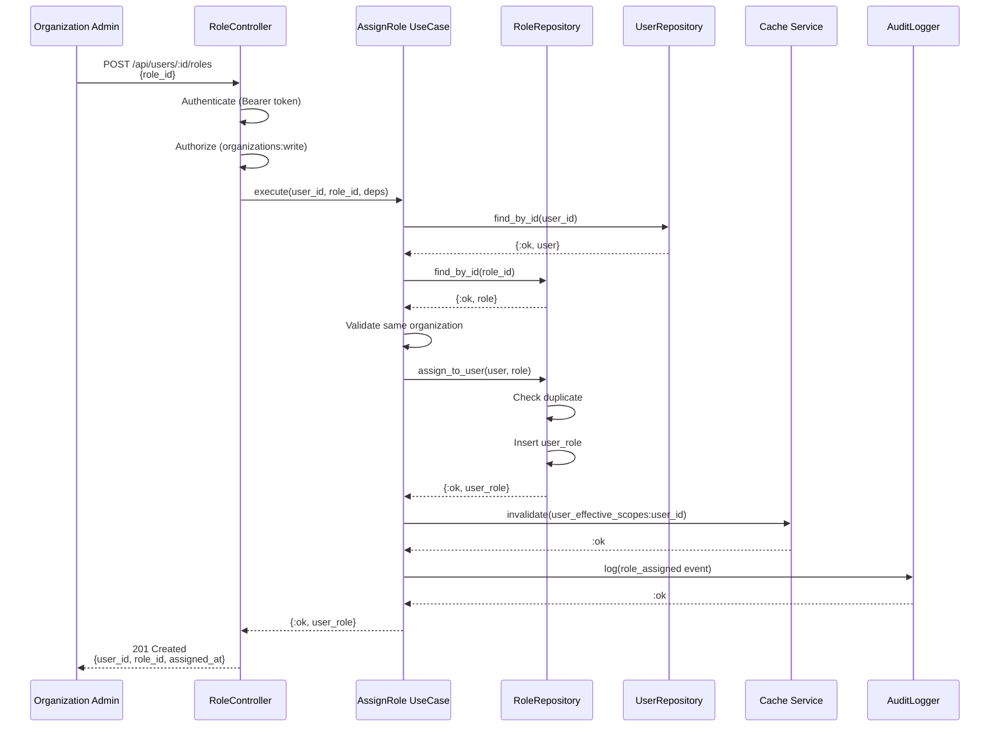
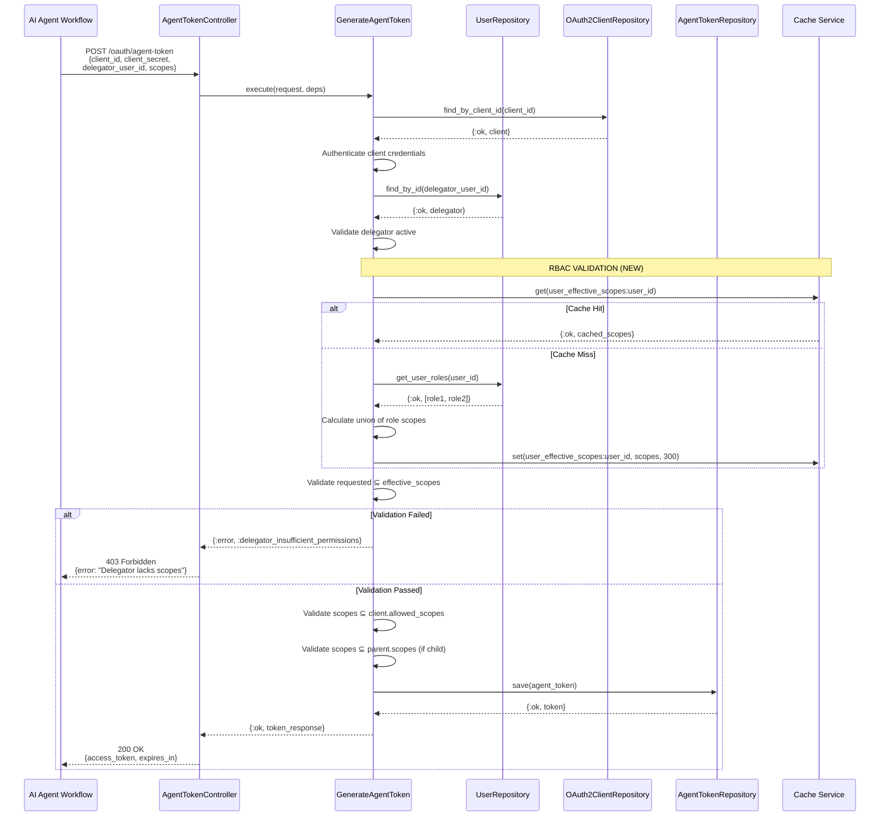
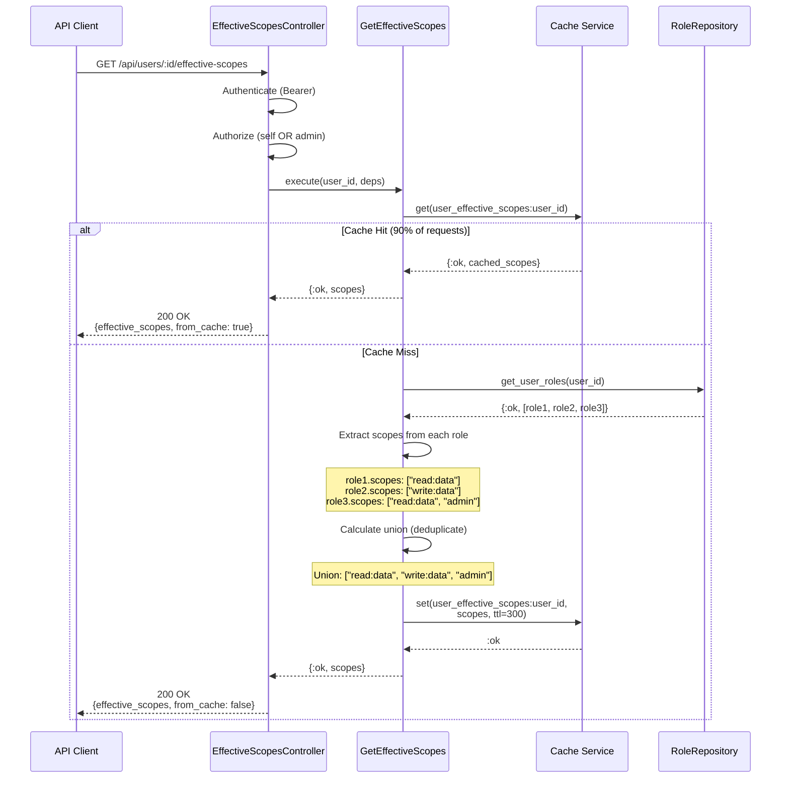
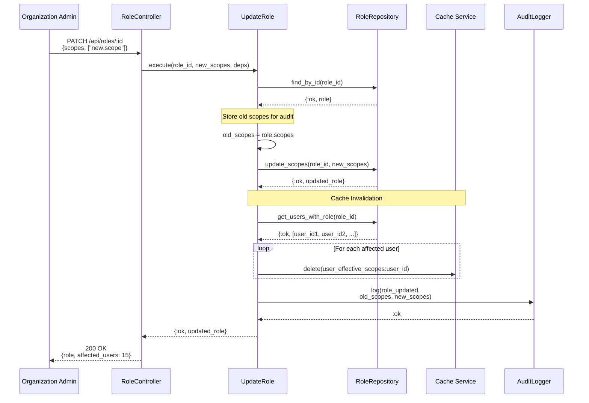
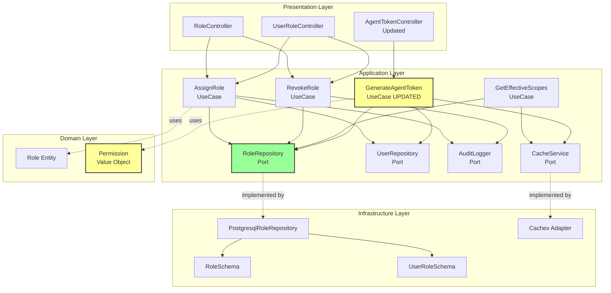

# Architecture & Diagrams
## Epic 9: Role-Based Access Control (RBAC)

**Document Version:** 1.0
**Date:** January 17, 2026
**Status:** Design Phase (Phase 2)

---

## 📐 System Architecture

### Clean Architecture Layers

```
┌──────────────────────────────────────────────────────┐
│  PRESENTATION LAYER (lib/thalamus_web/)              │
│                                                       │
│  ┌──────────────┐  ┌──────────────────┐             │
│  │ RoleController│  │UserRoleController│             │
│  │   (CRUD)     │  │  (Assignment)     │             │
│  └──────┬───────┘  └────────┬──────────┘             │
│         │                    │                        │
└─────────┼────────────────────┼────────────────────────┘
          │                    │
          ▼                    ▼
┌──────────────────────────────────────────────────────┐
│  APPLICATION LAYER (lib/thalamus/application/)       │
│                                                       │
│  ┌──────────────┐  ┌─────────────┐  ┌──────────────┐│
│  │  AssignRole  │  │ RevokeRole  │  │GetEffective  ││
│  │  Use Case    │  │  Use Case   │  │Scopes UseCase││
│  └──────┬───────┘  └──────┬──────┘  └──────┬───────┘│
│         │                 │                 │        │
│         └─────────────────┼─────────────────┘        │
│                           │                          │
│  Ports (Interfaces):      │                          │
│  • RoleRepository ────────┘                          │
│  • UserRepository                                    │
│  • AuditLogger                                       │
└──────────────────────────┬───────────────────────────┘
                           │
                           ▼
┌──────────────────────────────────────────────────────┐
│  DOMAIN LAYER (lib/thalamus/domain/)                 │
│                                                       │
│  ┌───────────────┐      ┌──────────────────┐        │
│  │  Role Entity  │      │Permission Value  │        │
│  │               │      │     Object       │        │
│  │ • validate()  │      │ • new(scope)     │        │
│  │ • add_scope() │      │ • valid_format?()│        │
│  └───────────────┘      └──────────────────┘        │
│                                                       │
└──────────────────────────┬───────────────────────────┘
                           │
                           ▼ (implemented by)
┌──────────────────────────────────────────────────────┐
│  INFRASTRUCTURE LAYER                                 │
│  (lib/thalamus/infrastructure/)                       │
│                                                       │
│  Schemas:                 Repositories:               │
│  • RoleSchema            • PostgresqlRoleRepository  │
│  • UserRoleSchema        • to_domain()               │
│  • Migrations            • to_changeset()            │
│                                                       │
└──────────────────────────────────────────────────────┘
```

---

## 🗄️ Entity-Relationship Diagram



**Key Relationships:**
- **Organization → Roles**: One-to-many (organization owns roles)
- **Role → UserRoles**: One-to-many (role assigned to many users)
- **User → UserRoles**: One-to-many (user has many roles)
- **Organization → Users**: One-to-many (multi-tenant isolation)

**Constraints:**
- `roles.name` unique within organization (composite unique index)
- `user_roles(user_id, role_id)` unique (prevent duplicate assignments)
- Cascade delete: Organization deleted → Roles deleted → UserRoles deleted

---

## 🔄 Sequence Diagrams

### 1. Role Assignment Flow



---

### 2. Agent Token Generation with RBAC Validation



---

### 3. Effective Scopes Calculation Flow



---

### 4. Role Scope Update with Cache Invalidation



---

## 🏗️ Component Diagram



**Legend:**
- 🟨 Yellow: Components updated/created in Epic 9
- 🟩 Green: New ports/interfaces
- → Solid line: Direct dependency
- ··> Dotted line: Implementation/usage

---

## 🔐 Security Architecture

### Multi-Tenant Isolation

```
┌──────────────────────────────────────────────┐
│  Organization A (org_acme)                   │
│  ┌─────────────────────────────────────────┐ │
│  │ Roles:                                  │ │
│  │  - "Admin" [all scopes]                 │ │
│  │  - "Developer" [read:*, write:code]     │ │
│  │                                         │ │
│  │ Users:                                  │ │
│  │  - user_alice (roles: Admin)            │ │
│  │  - user_bob (roles: Developer)          │ │
│  └─────────────────────────────────────────┘ │
└──────────────────────────────────────────────┘

┌──────────────────────────────────────────────┐
│  Organization B (org_beta)                   │
│  ┌─────────────────────────────────────────┐ │
│  │ Roles:                                  │ │
│  │  - "Manager" [read:*, mcp:*]            │ │
│  │                                         │ │
│  │ Users:                                  │ │
│  │  - user_charlie (roles: Manager)        │ │
│  └─────────────────────────────────────────┘ │
└──────────────────────────────────────────────┘

Database Constraints:
✅ roles.organization_id → organizations.id (FK)
✅ users.organization_id → organizations.id (FK)
✅ All queries: WHERE organization_id = ?

Security Guarantees:
❌ user_alice CANNOT assign role from org_beta
❌ user_charlie CANNOT see roles from org_acme
✅ Complete data isolation
```

---

## 📊 Data Flow Diagrams

### Write Flow: Role Assignment

```
Admin Request
     │
     ▼
[Authentication] ──────> Verify Bearer token
     │
     ▼
[Authorization] ───────> Check organizations:write scope
     │
     ▼
[Input Validation] ────> Validate user_id, role_id format
     │
     ▼
[Business Logic]
  ├─> Fetch user from DB
  ├─> Fetch role from DB
  ├─> Validate same organization
  ├─> Check not already assigned
  └─> Insert user_role record
     │
     ▼
[Cache Invalidation] ──> DELETE user_effective_scopes:{user_id}
     │
     ▼
[Audit Logging] ───────> Log role_assigned event
     │
     ▼
[Response] ────────────> 201 Created {user_id, role_id, assigned_at}
```

### Read Flow: Effective Scopes Query

```
Agent/User Request
     │
     ▼
[Authentication] ──────> Verify Bearer token (agent or user)
     │
     ▼
[Authorization] ───────> Verify self OR admin
     │
     ▼
[Cache Check]
     ├─> Cache HIT ──────> Return cached scopes (fast path)
     │
     └─> Cache MISS ─────> Calculate from DB
           │
           ▼
        [Query DB] ──────> SELECT roles WHERE user_id IN user_roles
           │
           ▼
        [Calculate Union] > Deduplicate scopes from all roles
           │
           ▼
        [Store Cache] ───> SET user_effective_scopes:{id}, TTL=300s
           │
           ▼
        [Return] ────────> Scopes array
```

---

## 🎯 Performance Characteristics

### Latency Targets

| Operation | Target p50 | Target p99 | Notes |
|-----------|------------|------------|-------|
| Get effective scopes (cache hit) | <2ms | <5ms | Cachex lookup |
| Get effective scopes (cache miss) | <8ms | <15ms | DB query + calculation |
| Assign role | <30ms | <50ms | DB insert + cache invalidate |
| Revoke role | <30ms | <50ms | DB delete + cache invalidate |
| Update role scopes | <50ms | <100ms | DB update + multi-user cache invalidate |

### Cache Strategy

```
Cache Key Format: user_effective_scopes:{user_id}
Cache Value: ["scope1", "scope2", ...]
TTL: 300 seconds (5 minutes)

Invalidation Events:
1. User role assigned → DELETE user_effective_scopes:{user_id}
2. User role revoked → DELETE user_effective_scopes:{user_id}
3. Role scopes updated → DELETE user_effective_scopes:{user_id} for ALL users with that role

Expected Hit Rate: >90% (roles change infrequently)
```

---

## 🧩 Integration Points

### With Existing Systems

**1. GenerateAgentToken Use Case (UPDATED)**
```elixir
# Before Epic 9
defp validate_delegator_has_scopes(_user, _scopes, _deps) do
  :ok  # Always allowed
end

# After Epic 9
defp validate_delegator_has_scopes(user, requested_scopes, deps) do
  case deps.user_repository.get_effective_scopes(user.id) do
    {:ok, []} -> :ok  # Backward compatible
    {:ok, user_scopes} ->
      requested_set = MapSet.new(requested_scopes)
      user_set = MapSet.new(user_scopes)

      if MapSet.subset?(requested_set, user_set) do
        :ok
      else
        {:error, :delegator_insufficient_permissions}
      end
  end
end
```

**2. UserRepository Port (EXTENDED)**
```elixir
# New callback added
@callback get_effective_scopes(user_id :: binary()) ::
  {:ok, [String.t()]} | {:error, :not_found}
```

---

## 📝 Design Patterns Used

### 1. Repository Pattern
- **Port**: `RoleRepository` behaviour (application layer)
- **Adapter**: `PostgresqlRoleRepository` (infrastructure layer)
- **Benefit**: Database-agnostic business logic

### 2. Use Case Pattern (Clean Architecture)
- **AssignRole**, **RevokeRole**, **GetEffectiveScopes**
- **Benefit**: Single responsibility, testable with mocks

### 3. Value Object Pattern
- **Permission** (scope string validation)
- **Benefit**: Validation centralized, immutable

### 4. Strategy Pattern (Cache Invalidation)
- **Multi-user invalidation**: When role scopes change
- **Single-user invalidation**: When user roles change
- **Benefit**: Flexible, cache stays consistent

---

**Document Status:** ✅ Complete
**Next:** [02-design-components.md](02-design-components.md) - Code implementations
