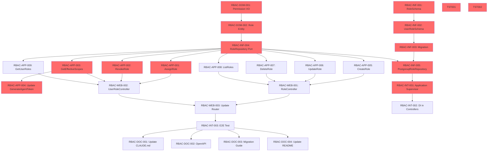

# Implementation Tasks
## Epic 9: Role-Based Access Control (RBAC)

**Document Version:** 1.0
**Date:** January 17, 2026
**Status:** Ready for Implementation
**Phase:** 3 (Tasks)

---

## Table of Contents

1. [Overview](#overview)
2. [Task Organization](#task-organization)
3. [Domain Layer Tasks](#domain-layer-tasks)
4. [Infrastructure Layer Tasks](#infrastructure-layer-tasks)
5. [Application Layer Tasks](#application-layer-tasks)
6. [Presentation Layer Tasks](#presentation-layer-tasks)
7. [Integration Tasks](#integration-tasks)
8. [Testing Tasks](#testing-tasks)
9. [Documentation Tasks](#documentation-tasks)
10. [Task Dependencies](#task-dependencies)
11. [Implementation Order](#implementation-order)

---

## Overview

This document breaks down Epic 9 (RBAC) into **37 discrete tasks** organized by Clean Architecture layers. Each task is:
- **Atomic**: Can be completed in 1-4 hours
- **Testable**: Has clear acceptance criteria
- **Independent**: Minimal dependencies on other tasks

**Total Estimated Effort:** ~80-100 hours (2-3 weeks for 1 developer)

**Priorities:**
- **P0 (Critical)**: 12 tasks - Core RBAC functionality
- **P1 (High)**: 15 tasks - Full feature completion
- **P2 (Medium)**: 10 tasks - Polish and optimization

---

## Task Organization

### Naming Convention

```
RBAC-{Layer}-{Number}: {Description}
```

**Layers:**
- `DOM` - Domain Layer
- `INF` - Infrastructure Layer
- `APP` - Application Layer
- `WEB` - Presentation Layer (Web/API)
- `INT` - Integration
- `TST` - Testing
- `DOC` - Documentation

**Examples:**
- `RBAC-DOM-001`: Create Permission Value Object
- `RBAC-APP-005`: Implement GetEffectiveScopes Use Case
- `RBAC-WEB-010`: Create RoleController

---

## Domain Layer Tasks

### RBAC-DOM-001: Create Permission Value Object ⭐ P0

**Description:** Implement `Thalamus.Domain.ValueObjects.Permission` with scope format validation

**Acceptance Criteria:**
- ✅ `Permission.new(scope)` validates format with regex `^[a-z][a-z0-9_-]*(?::[a-z][a-z0-9_-]*){0,3}$`
- ✅ Max length 128 characters
- ✅ Returns `{:error, :invalid_scope_format}` for invalid scopes
- ✅ Returns `{:error, :scope_too_long}` for scopes > 128 chars
- ✅ `String.Chars` protocol implemented
- ✅ `Jason.Encoder` protocol implemented

**Files to Create:**
- `lib/thalamus/domain/value_objects/permission.ex`

**Tests:**
- `test/thalamus/domain/value_objects/permission_test.exs`
  - Valid scopes: `openid`, `zea:read`, `mcp:gmail:read`, `mcp:slack:channels:list`
  - Invalid scopes: `CAPS`, `123start`, `too:many:colons:here:invalid`
  - Edge cases: empty string, 129-char string

**Estimated Time:** 2 hours

**Dependencies:** None

---

### RBAC-DOM-002: Create Role Entity ⭐ P0

**Description:** Implement `Thalamus.Domain.Entities.Role` with business logic

**Acceptance Criteria:**
- ✅ `Role.new(attrs)` validates:
  - `name`: 1-100 chars, alphanumeric + spaces
  - `organization_id`: non-nil UUID
  - `scopes`: list of valid Permission value objects
  - `description`: optional, max 500 chars
- ✅ `Role.update_scopes(role, new_scopes)` validates and updates scopes
- ✅ `Role.add_scope(role, scope)` adds single scope
- ✅ `Role.remove_scope(role, scope)` removes single scope
- ✅ Immutable updates (returns new struct)

**Files to Create:**
- `lib/thalamus/domain/entities/role.ex`

**Tests:**
- `test/thalamus/domain/entities/role_test.exs`
  - Valid role creation
  - Invalid name (too long, empty, special chars)
  - Invalid scopes (via Permission VO)
  - Scope updates (add, remove, replace)

**Estimated Time:** 3 hours

**Dependencies:** RBAC-DOM-001

---

## Infrastructure Layer Tasks

### RBAC-INF-001: Create RoleSchema (Ecto) ⭐ P0

**Description:** Create Ecto schema for `roles` table

**Acceptance Criteria:**
- ✅ Schema fields: `id`, `organization_id`, `name`, `description`, `scopes`, `created_at`, `updated_at`
- ✅ `belongs_to :organization`
- ✅ `has_many :user_roles`
- ✅ Primary key: UUID
- ✅ Timestamps: `utc_datetime`

**Files to Create:**
- `lib/thalamus/infrastructure/persistence/schemas/role_schema.ex`

**Tests:**
- `test/thalamus/infrastructure/persistence/schemas/role_schema_test.exs`
  - Changeset validation (name, organization_id required)
  - Scopes array handling

**Estimated Time:** 1 hour

**Dependencies:** None

---

### RBAC-INF-002: Create UserRoleSchema (Ecto) ⭐ P0

**Description:** Create Ecto schema for `user_roles` join table

**Acceptance Criteria:**
- ✅ Schema fields: `id`, `user_id`, `role_id`, `assigned_by`, `assigned_at`, `created_at`
- ✅ `belongs_to :user`
- ✅ `belongs_to :role`
- ✅ `belongs_to :assigned_by_user` (optional)
- ✅ Primary key: UUID
- ✅ `assigned_at` defaults to `DateTime.utc_now()`

**Files to Create:**
- `lib/thalamus/infrastructure/persistence/schemas/user_role_schema.ex`

**Tests:**
- `test/thalamus/infrastructure/persistence/schemas/user_role_schema_test.exs`
  - Changeset validation (user_id, role_id required)
  - assigned_by nullable

**Estimated Time:** 1 hour

**Dependencies:** RBAC-INF-001

---

### RBAC-INF-003: Create Database Migration ⭐ P0

**Description:** Create migration for `roles` and `user_roles` tables

**Acceptance Criteria:**
- ✅ `roles` table with:
  - UUID primary key
  - `organization_id` foreign key (ON DELETE CASCADE)
  - `name` string(100), NOT NULL
  - `description` text, nullable
  - `scopes` string array, default `[]`
  - Unique index on `(organization_id, name)`
  - Index on `organization_id`
  - Timestamps
- ✅ `user_roles` table with:
  - UUID primary key
  - `user_id` foreign key (ON DELETE CASCADE)
  - `role_id` foreign key (ON DELETE CASCADE)
  - `assigned_by` foreign key (ON DELETE SET NULL)
  - `assigned_at` utc_datetime, default NOW()
  - Unique index on `(user_id, role_id)`
  - Index on `user_id`
  - Index on `role_id`
  - Timestamps

**Files to Create:**
- `priv/repo/migrations/YYYYMMDDHHMMSS_add_rbac_tables.exs`

**Tests:**
- `test/thalamus/infrastructure/persistence/migrations_test.exs`
  - Run migration up
  - Test foreign key constraints
  - Test unique constraints
  - Run migration down (rollback)

**Estimated Time:** 2 hours

**Dependencies:** RBAC-INF-001, RBAC-INF-002

---

### RBAC-INF-004: Create RoleRepository Port (Behaviour) ⭐ P0

**Description:** Define `Thalamus.Application.Ports.RoleRepository` behaviour

**Acceptance Criteria:**
- ✅ Callbacks defined:
  - `@callback create(Role.t()) :: {:ok, Role.t()} | {:error, term()}`
  - `@callback find_by_id(binary()) :: {:ok, Role.t()} | {:error, :not_found}`
  - `@callback find_by_name(binary(), binary()) :: {:ok, Role.t()} | {:error, :not_found}`
  - `@callback list_by_organization(binary()) :: {:ok, [Role.t()]}`
  - `@callback update(binary(), map()) :: {:ok, Role.t()} | {:error, term()}`
  - `@callback delete(binary()) :: {:ok, Role.t()} | {:error, term()}`
  - `@callback assign_to_user(binary(), binary(), binary() | nil) :: {:ok, term()} | {:error, term()}`
  - `@callback revoke_from_user(binary(), binary()) :: {:ok, term()} | {:error, term()}`
  - `@callback get_user_roles(binary()) :: {:ok, [Role.t()]}`
  - `@callback get_users_with_role(binary()) :: {:ok, [binary()]}`

**Files to Create:**
- `lib/thalamus/application/ports/role_repository.ex`

**Tests:**
- No direct tests (interface definition)

**Estimated Time:** 1 hour

**Dependencies:** RBAC-DOM-002

---

### RBAC-INF-005: Implement PostgresqlRoleRepository ⭐ P0

**Description:** Implement RoleRepository port with PostgreSQL

**Acceptance Criteria:**
- ✅ Implements all `RoleRepository` callbacks
- ✅ `to_domain/1` converts `RoleSchema` → `Role` entity
- ✅ `to_changeset/1` converts `Role` entity → `RoleSchema` changeset
- ✅ All queries scoped by `organization_id`
- ✅ Multi-tenant isolation enforced
- ✅ Error handling for DB constraints (unique, foreign key)

**Files to Create:**
- `lib/thalamus/infrastructure/repositories/postgresql_role_repository.ex`

**Tests:**
- `test/thalamus/infrastructure/repositories/postgresql_role_repository_test.exs`
  - Create role (success, duplicate name error)
  - Find by ID (found, not found)
  - List by organization (multi-tenant isolation)
  - Update role (success, not found)
  - Delete role (success, cascade delete user_roles)
  - Assign to user (success, duplicate error)
  - Revoke from user (success, not found)
  - Get user roles (multiple roles, empty list)
  - Get users with role

**Estimated Time:** 5 hours

**Dependencies:** RBAC-INF-003, RBAC-INF-004

---

### RBAC-INF-006: Add CacheService.delete/1 to Redis Adapter ⭐ P1

**Description:** Ensure Redis cache adapter supports delete operation

**Acceptance Criteria:**
- ✅ `RedisCacheAdapter.delete(key)` calls `Redix.command(["DEL", key])`
- ✅ Returns `:ok` on success
- ✅ Handles Redis connection errors gracefully

**Files to Modify:**
- `lib/thalamus/infrastructure/adapters/redis_cache_adapter.ex`

**Tests:**
- `test/thalamus/infrastructure/adapters/redis_cache_adapter_test.exs`
  - Delete existing key
  - Delete non-existent key
  - Delete with Redis connection error

**Estimated Time:** 1 hour

**Dependencies:** None

---

## Application Layer Tasks

### RBAC-APP-001: Create AssignRole Use Case ⭐ P0

**Description:** Implement `Thalamus.Application.UseCases.AssignRole`

**Acceptance Criteria:**
- ✅ Validates role exists
- ✅ Validates user exists
- ✅ Validates user and role in same organization
- ✅ Prevents duplicate assignments
- ✅ Creates `user_roles` record with `assigned_by` audit
- ✅ Invalidates cache: `user_effective_scopes:{user_id}`
- ✅ Returns `{:ok, %{user_id, role, assigned_at}}`

**Error Cases:**
- `{:error, :role_not_found}`
- `{:error, :user_not_found}`
- `{:error, :cross_organization}`
- `{:error, :already_assigned}`

**Files to Create:**
- `lib/thalamus/application/use_cases/assign_role.ex`
- `lib/thalamus/application/dtos/assign_role_request.ex`

**Tests:**
- `test/thalamus/application/use_cases/assign_role_test.exs`
  - Happy path (successful assignment)
  - Role not found
  - User not found
  - Cross-organization attempt
  - Duplicate assignment
  - Cache invalidation called

**Estimated Time:** 3 hours

**Dependencies:** RBAC-INF-004, RBAC-INF-006

---

### RBAC-APP-002: Create RevokeRole Use Case ⭐ P0

**Description:** Implement `Thalamus.Application.UseCases.RevokeRole`

**Acceptance Criteria:**
- ✅ Validates user-role assignment exists
- ✅ Deletes `user_roles` record
- ✅ Invalidates cache: `user_effective_scopes:{user_id}`
- ✅ Returns `{:ok, %{user_id, role_id, revoked_at}}`

**Error Cases:**
- `{:error, :assignment_not_found}`

**Files to Create:**
- `lib/thalamus/application/use_cases/revoke_role.ex`

**Tests:**
- `test/thalamus/application/use_cases/revoke_role_test.exs`
  - Happy path
  - Assignment not found
  - Cache invalidation called

**Estimated Time:** 2 hours

**Dependencies:** RBAC-INF-004, RBAC-INF-006

---

### RBAC-APP-003: Create GetEffectiveScopes Use Case ⭐ P0

**Description:** Implement `Thalamus.Application.UseCases.GetEffectiveScopes`

**Acceptance Criteria:**
- ✅ Checks cache first: `user_effective_scopes:{user_id}`
- ✅ On cache hit: returns cached scopes
- ✅ On cache miss:
  - Queries `get_user_roles(user_id)`
  - Calculates union of all `role.scopes`
  - Sorts alphabetically
  - Caches result (TTL: 300 seconds)
  - Returns scopes
- ✅ Returns `{:ok, [scope1, scope2, ...]}`
- ✅ Returns `{:ok, []}` if user has no roles (backward compatible)

**Files to Create:**
- `lib/thalamus/application/use_cases/get_effective_scopes.ex`
- `lib/thalamus/application/dtos/effective_scopes_response.ex`

**Tests:**
- `test/thalamus/application/use_cases/get_effective_scopes_test.exs`
  - Cache hit
  - Cache miss → query → cache
  - Multiple roles → union calculation
  - No roles → empty list
  - Cache put error (graceful handling)

**Estimated Time:** 3 hours

**Dependencies:** RBAC-INF-004, RBAC-INF-006

---

### RBAC-APP-004: Update GenerateAgentToken Use Case ⭐ P0

**Description:** Integrate RBAC validation into existing `GenerateAgentToken` use case

**Acceptance Criteria:**
- ✅ Calls `GetEffectiveScopes.execute(delegator_user_id, deps)`
- ✅ If effective scopes = `[]`: allow delegation (backward compatible)
- ✅ If effective scopes ≠ `[]`: validate requested scopes ⊆ effective scopes
- ✅ Returns `{:error, :insufficient_permissions}` if validation fails
- ✅ Logs validation result (info level)

**Files to Modify:**
- `lib/thalamus/application/use_cases/generate_agent_token.ex`

**Tests:**
- `test/thalamus/application/use_cases/generate_agent_token_test.exs`
  - User with no roles → allows delegation
  - User with roles → requested scopes subset → allows delegation
  - User with roles → requested scopes NOT subset → rejects delegation
  - GetEffectiveScopes called with correct user_id

**Estimated Time:** 2 hours

**Dependencies:** RBAC-APP-003

---

### RBAC-APP-005: Create CreateRole Use Case ⭐ P1

**Description:** Implement `Thalamus.Application.UseCases.CreateRole`

**Acceptance Criteria:**
- ✅ Validates request via `Role.new/1`
- ✅ Checks for duplicate role name (case-insensitive)
- ✅ Creates role via `RoleRepository.create/1`
- ✅ Returns `{:ok, role}`

**Error Cases:**
- `{:error, :duplicate_role_name}`
- `{:error, :invalid_role_name}`
- `{:error, :invalid_scope_format}`

**Files to Create:**
- `lib/thalamus/application/use_cases/create_role.ex`
- `lib/thalamus/application/dtos/create_role_request.ex`

**Tests:**
- `test/thalamus/application/use_cases/create_role_test.exs`
  - Happy path
  - Duplicate name (same org)
  - Invalid name
  - Invalid scope format

**Estimated Time:** 2 hours

**Dependencies:** RBAC-INF-004

---

### RBAC-APP-006: Create UpdateRole Use Case ⭐ P1

**Description:** Implement `Thalamus.Application.UseCases.UpdateRole`

**Acceptance Criteria:**
- ✅ Validates role exists
- ✅ Updates scopes via `Role.update_scopes/2`
- ✅ Persists via `RoleRepository.update/2`
- ✅ Gets all users with role: `RoleRepository.get_users_with_role/1`
- ✅ Invalidates cache for ALL affected users
- ✅ Returns `{:ok, %{role, invalidated_cache_for: count}}`

**Error Cases:**
- `{:error, :role_not_found}`
- `{:error, :invalid_scope_format}`

**Files to Create:**
- `lib/thalamus/application/use_cases/update_role.ex`

**Tests:**
- `test/thalamus/application/use_cases/update_role_test.exs`
  - Happy path with cache invalidation
  - Role not found
  - Invalid scope format
  - Cache delete called for each affected user

**Estimated Time:** 3 hours

**Dependencies:** RBAC-INF-004, RBAC-INF-006

---

### RBAC-APP-007: Create DeleteRole Use Case ⭐ P1

**Description:** Implement `Thalamus.Application.UseCases.DeleteRole`

**Acceptance Criteria:**
- ✅ Validates role exists
- ✅ Gets users with role (for cache invalidation)
- ✅ Deletes role via `RoleRepository.delete/1` (cascades user_roles)
- ✅ Invalidates cache for ALL affected users
- ✅ Returns `{:ok, %{deleted_role_id, invalidated_cache_for: count}}`

**Error Cases:**
- `{:error, :role_not_found}`

**Files to Create:**
- `lib/thalamus/application/use_cases/delete_role.ex`

**Tests:**
- `test/thalamus/application/use_cases/delete_role_test.exs`
  - Happy path with cache invalidation
  - Role not found
  - Cascade deletion of user_roles verified
  - Cache delete called for each affected user

**Estimated Time:** 2 hours

**Dependencies:** RBAC-INF-004, RBAC-INF-006

---

### RBAC-APP-008: Create ListRoles Use Case ⭐ P1

**Description:** Implement `Thalamus.Application.UseCases.ListRoles`

**Acceptance Criteria:**
- ✅ Lists all roles for organization via `RoleRepository.list_by_organization/1`
- ✅ Supports pagination (offset, limit)
- ✅ Returns `{:ok, %{roles, total, page, per_page}}`

**Files to Create:**
- `lib/thalamus/application/use_cases/list_roles.ex`

**Tests:**
- `test/thalamus/application/use_cases/list_roles_test.exs`
  - List all roles
  - Pagination
  - Multi-tenant isolation

**Estimated Time:** 2 hours

**Dependencies:** RBAC-INF-004

---

### RBAC-APP-009: Create GetUserRoles Use Case ⭐ P1

**Description:** Implement `Thalamus.Application.UseCases.GetUserRoles`

**Acceptance Criteria:**
- ✅ Gets user roles via `RoleRepository.get_user_roles/1`
- ✅ Returns `{:ok, [role1, role2, ...]}`
- ✅ Returns `{:ok, []}` if user has no roles

**Files to Create:**
- `lib/thalamus/application/use_cases/get_user_roles.ex`

**Tests:**
- `test/thalamus/application/use_cases/get_user_roles_test.exs`
  - User with multiple roles
  - User with no roles
  - Multi-tenant isolation

**Estimated Time:** 1 hour

**Dependencies:** RBAC-INF-004

---

## Presentation Layer Tasks

### RBAC-WEB-001: Create RoleController ⭐ P1

**Description:** Create Phoenix controller for role CRUD operations

**Acceptance Criteria:**
- ✅ Routes:
  - `POST /api/roles` → `create/2`
  - `GET /api/roles` → `index/2`
  - `PATCH /api/roles/:id` → `update/2`
  - `DELETE /api/roles/:id` → `delete/2`
- ✅ Authentication: Bearer token required
- ✅ Authorization: `organizations:write` scope required
- ✅ Extract `organization_id` from token claims
- ✅ Call corresponding use cases
- ✅ Return JSON responses (200, 201, 404, 422, 500)

**Files to Create:**
- `lib/thalamus_web/controllers/api/role_controller.ex`
- `lib/thalamus_web/views/api/role_view.ex` (JSON rendering)

**Tests:**
- `test/thalamus_web/controllers/api/role_controller_test.exs`
  - Create role (201, 422 duplicate name)
  - List roles (200, pagination)
  - Update role (200, 404 not found)
  - Delete role (200, 404 not found)
  - Unauthorized (401)
  - Forbidden (403 missing scope)

**Estimated Time:** 4 hours

**Dependencies:** RBAC-APP-005, RBAC-APP-006, RBAC-APP-007, RBAC-APP-008

---

### RBAC-WEB-002: Create UserRoleController ⭐ P1

**Description:** Create Phoenix controller for user-role assignments

**Acceptance Criteria:**
- ✅ Routes:
  - `POST /api/users/:user_id/roles` → `assign/2`
  - `DELETE /api/users/:user_id/roles/:role_id` → `revoke/2`
  - `GET /api/users/:user_id/roles` → `index/2`
  - `GET /api/users/:user_id/effective-scopes` → `effective_scopes/2`
- ✅ Authentication modes:
  - Mode 1 (assign/revoke): Bearer token + `organizations:write`
  - Mode 2 (index/scopes): Agent token + delegator validation
- ✅ Call corresponding use cases
- ✅ Return JSON responses

**Files to Create:**
- `lib/thalamus_web/controllers/api/user_role_controller.ex`
- `lib/thalamus_web/views/api/user_role_view.ex`

**Tests:**
- `test/thalamus_web/controllers/api/user_role_controller_test.exs`
  - Assign role (201, 409 duplicate, 422 cross-org)
  - Revoke role (200, 404 not found)
  - Get user roles (200, empty list)
  - Get effective scopes (200, cached/uncached)
  - Unauthorized (401)
  - Forbidden (403 missing scope)
  - Agent mode authorization

**Estimated Time:** 4 hours

**Dependencies:** RBAC-APP-001, RBAC-APP-002, RBAC-APP-003, RBAC-APP-009

---

### RBAC-WEB-003: Update Router with RBAC Routes ⭐ P1

**Description:** Add RBAC routes to `lib/thalamus_web/router.ex`

**Acceptance Criteria:**
- ✅ Routes added to `:authenticated_api` pipeline
- ✅ Rate limiting: 100 req/min per user
- ✅ Scoped under `/api` namespace

**Files to Modify:**
- `lib/thalamus_web/router.ex`

**Tests:**
- `test/thalamus_web/router_test.exs`
  - Verify routes exist
  - Verify pipeline applied

**Estimated Time:** 1 hour

**Dependencies:** RBAC-WEB-001, RBAC-WEB-002

---

### RBAC-WEB-004: Create RequireAuth Plug (if not exists) ⭐ P1

**Description:** Ensure `RequireAuth` plug validates Bearer and Agent tokens

**Acceptance Criteria:**
- ✅ Decodes Bearer token (JWT)
- ✅ Decodes Agent token (Joken)
- ✅ Sets `conn.assigns.current_user`
- ✅ Returns 401 for invalid tokens

**Files to Create/Modify:**
- `lib/thalamus_web/plugs/require_auth.ex`

**Tests:**
- `test/thalamus_web/plugs/require_auth_test.exs`
  - Valid Bearer token
  - Valid Agent token
  - Invalid token
  - Expired token

**Estimated Time:** 2 hours

**Dependencies:** None

---

## Integration Tasks

### RBAC-INT-001: Add RoleRepository to Application Supervisor ⭐ P0

**Description:** Register `PostgresqlRoleRepository` in application dependencies

**Acceptance Criteria:**
- ✅ Add to `lib/thalamus/application.ex` supervisor tree
- ✅ Available for dependency injection in use cases

**Files to Modify:**
- `lib/thalamus/application.ex`

**Tests:**
- No direct tests (integration test coverage)

**Estimated Time:** 0.5 hours

**Dependencies:** RBAC-INF-005

---

### RBAC-INT-002: Update Dependency Injection in Controllers ⭐ P1

**Description:** Inject `RoleRepository` into use case deps maps

**Acceptance Criteria:**
- ✅ Controllers pass `role_repository: PostgresqlRoleRepository` to use cases
- ✅ Cache service injected: `cache_service: RedisCacheAdapter`

**Files to Modify:**
- `lib/thalamus_web/controllers/api/role_controller.ex`
- `lib/thalamus_web/controllers/api/user_role_controller.ex`
- `lib/thalamus_web/controllers/oauth2/agent_token_controller.ex`

**Tests:**
- Integration tests verify correct repository used

**Estimated Time:** 1 hour

**Dependencies:** RBAC-INT-001

---

### RBAC-INT-003: End-to-End Integration Test ⭐ P1

**Description:** Full workflow integration test (create role → assign → generate token)

**Acceptance Criteria:**
- ✅ Create role "Developer" with scopes `[read:code, write:code]`
- ✅ Assign role to user
- ✅ Generate agent token with scope `read:code` → success
- ✅ Generate agent token with scope `delete:prod` → failure (insufficient permissions)
- ✅ Revoke role
- ✅ Generate agent token with scope `read:code` → success (backward compatible, no roles)

**Files to Create:**
- `test/integration/rbac_workflow_test.exs`

**Tests:**
- Full end-to-end workflow

**Estimated Time:** 3 hours

**Dependencies:** All RBAC-WEB tasks

---

## Testing Tasks

### RBAC-TST-001: Domain Layer Test Coverage (100%) ⭐ P0

**Description:** Ensure 100% test coverage for domain layer

**Acceptance Criteria:**
- ✅ Permission VO: 100% line coverage
- ✅ Role Entity: 100% line coverage
- ✅ All edge cases tested

**Files:**
- `test/thalamus/domain/value_objects/permission_test.exs`
- `test/thalamus/domain/entities/role_test.exs`

**Estimated Time:** 2 hours (included in RBAC-DOM tasks)

**Dependencies:** RBAC-DOM-001, RBAC-DOM-002

---

### RBAC-TST-002: Application Layer Test Coverage (90%) ⭐ P0

**Description:** Ensure 90%+ test coverage for application layer

**Acceptance Criteria:**
- ✅ All use cases: happy path + error scenarios
- ✅ Mox used for repository mocks
- ✅ Cache invalidation verified

**Files:**
- All `test/thalamus/application/use_cases/*_test.exs`

**Estimated Time:** 5 hours (included in RBAC-APP tasks)

**Dependencies:** All RBAC-APP tasks

---

### RBAC-TST-003: Infrastructure Layer Test Coverage (85%) ⭐ P1

**Description:** Ensure 85%+ test coverage for infrastructure layer

**Acceptance Criteria:**
- ✅ Repository integration tests with real DB
- ✅ Multi-tenant isolation verified
- ✅ Foreign key constraints tested
- ✅ Cascade deletion tested

**Files:**
- `test/thalamus/infrastructure/repositories/postgresql_role_repository_test.exs`

**Estimated Time:** 3 hours (included in RBAC-INF-005)

**Dependencies:** RBAC-INF-005

---

### RBAC-TST-004: API Layer Test Coverage (85%) ⭐ P1

**Description:** Ensure 85%+ test coverage for API layer

**Acceptance Criteria:**
- ✅ Controller tests with ConnCase
- ✅ Authentication/authorization tests
- ✅ Error response format tests
- ✅ All HTTP status codes tested

**Files:**
- `test/thalamus_web/controllers/api/role_controller_test.exs`
- `test/thalamus_web/controllers/api/user_role_controller_test.exs`

**Estimated Time:** 4 hours (included in RBAC-WEB tasks)

**Dependencies:** RBAC-WEB-001, RBAC-WEB-002

---

### RBAC-TST-005: Performance Benchmark Test ⭐ P2

**Description:** Benchmark effective scopes calculation performance

**Acceptance Criteria:**
- ✅ User with 5 roles (25 total scopes)
- ✅ Cache miss: <10ms p99
- ✅ Cache hit: <1ms p99
- ✅ 10,000 iterations for statistical significance

**Files to Create:**
- `test/benchmarks/rbac_performance_test.exs`

**Estimated Time:** 2 hours

**Dependencies:** RBAC-APP-003

---

## Documentation Tasks

### RBAC-DOC-001: Update CLAUDE.md ⭐ P1

**Description:** Document RBAC in project instructions

**Acceptance Criteria:**
- ✅ Add RBAC to "Core features implemented" section
- ✅ Add Permission VO to value objects list
- ✅ Add Role entity to entities list
- ✅ Add RBAC use cases to application layer section

**Files to Modify:**
- `CLAUDE.md`

**Estimated Time:** 1 hour

**Dependencies:** All implementation complete

---

### RBAC-DOC-002: Update API Documentation (OpenAPI) ⭐ P1

**Description:** Add RBAC endpoints to OpenAPI spec

**Acceptance Criteria:**
- ✅ 8 new endpoints documented
- ✅ Request/response schemas
- ✅ Authentication modes specified
- ✅ Error responses documented

**Files to Modify:**
- `docs/OPENAPI_SPEC.yaml`

**Estimated Time:** 2 hours

**Dependencies:** RBAC-WEB-003

---

### RBAC-DOC-003: Create Migration Guide ⭐ P2

**Description:** Document migration guide for existing deployments

**Acceptance Criteria:**
- ✅ Migration steps (run migration, restart server)
- ✅ Backward compatibility notes
- ✅ Rollback instructions
- ✅ Testing checklist

**Files to Create:**
- `docs/RBAC_MIGRATION_GUIDE.md`

**Estimated Time:** 2 hours

**Dependencies:** All implementation complete

---

### RBAC-DOC-004: Update README.md ⭐ P2

**Description:** Add RBAC to README features list

**Acceptance Criteria:**
- ✅ Mention in "Core Features" section
- ✅ Link to design docs

**Files to Modify:**
- `README.md`

**Estimated Time:** 0.5 hours

**Dependencies:** All implementation complete

---

## Task Dependencies

### Dependency Graph (Mermaid)



---

## Implementation Order

### Sprint 1: Core Foundation (Week 1) - P0 Tasks

**Goal:** Implement core RBAC domain and infrastructure

**Tasks (in order):**
1. ✅ RBAC-DOM-001: Permission VO (2h)
2. ✅ RBAC-DOM-002: Role Entity (3h)
3. ✅ RBAC-INF-001: RoleSchema (1h)
4. ✅ RBAC-INF-002: UserRoleSchema (1h)
5. ✅ RBAC-INF-003: Migration (2h)
6. ✅ RBAC-INF-004: RoleRepository Port (1h)
7. ✅ RBAC-INF-005: PostgresqlRoleRepository (5h)
8. ✅ RBAC-INF-006: Redis delete operation (1h)
9. ✅ RBAC-INT-001: Application Supervisor (0.5h)

**Total:** ~16.5 hours

**Milestone:** Database and repository layer complete, tests passing

---

### Sprint 2: Application Layer (Week 1-2) - P0 Tasks

**Goal:** Implement core use cases with RBAC validation

**Tasks (in order):**
1. ✅ RBAC-APP-001: AssignRole (3h)
2. ✅ RBAC-APP-002: RevokeRole (2h)
3. ✅ RBAC-APP-003: GetEffectiveScopes (3h)
4. ✅ RBAC-APP-004: Update GenerateAgentToken (2h)
5. ✅ RBAC-TST-001: Domain tests (included above)
6. ✅ RBAC-TST-002: Application tests (included above)

**Total:** ~10 hours

**Milestone:** Core RBAC logic complete, agent token validation working

---

### Sprint 3: API Layer (Week 2) - P1 Tasks

**Goal:** Expose RBAC via REST API

**Tasks (in order):**
1. ✅ RBAC-APP-005: CreateRole (2h)
2. ✅ RBAC-APP-006: UpdateRole (3h)
3. ✅ RBAC-APP-007: DeleteRole (2h)
4. ✅ RBAC-APP-008: ListRoles (2h)
5. ✅ RBAC-APP-009: GetUserRoles (1h)
6. ✅ RBAC-WEB-001: RoleController (4h)
7. ✅ RBAC-WEB-002: UserRoleController (4h)
8. ✅ RBAC-WEB-003: Update Router (1h)
9. ✅ RBAC-WEB-004: RequireAuth plug (2h)
10. ✅ RBAC-INT-002: DI in Controllers (1h)
11. ✅ RBAC-TST-003: Infrastructure tests (included in INF-005)
12. ✅ RBAC-TST-004: API tests (included in WEB tasks)

**Total:** ~22 hours

**Milestone:** Full REST API functional, all CRUD operations working

---

### Sprint 4: Integration & Documentation (Week 2-3) - P1/P2 Tasks

**Goal:** End-to-end testing and documentation

**Tasks (in order):**
1. ✅ RBAC-INT-003: E2E Integration Test (3h)
2. ✅ RBAC-TST-005: Performance Benchmark (2h) - P2
3. ✅ RBAC-DOC-001: Update CLAUDE.md (1h)
4. ✅ RBAC-DOC-002: OpenAPI spec (2h)
5. ✅ RBAC-DOC-003: Migration Guide (2h) - P2
6. ✅ RBAC-DOC-004: Update README (0.5h) - P2

**Total:** ~10.5 hours

**Milestone:** Epic 9 complete, production-ready

---

## Summary

**Total Tasks:** 37
**Total Estimated Time:** ~80-100 hours
**Sprints:** 4 (over 2-3 weeks for 1 developer)

**Critical Path (P0):** 12 tasks (~26.5 hours)
**High Priority (P1):** 15 tasks (~40 hours)
**Medium Priority (P2):** 10 tasks (~13.5 hours)

**Test Coverage Targets:**
- Domain: 100%
- Application: 90%
- Infrastructure: 85%
- API: 85%

**Performance Targets:**
- Effective scopes calculation: <10ms p99 (cache miss)
- Cache hit rate: >90%
- API response time: <100ms p99

---

**Phase 3 Status:** ✅ **COMPLETE**

**Next Steps:**
1. Review task breakdown with team
2. Assign tasks to developers
3. Create GitHub issues/tickets
4. Begin Sprint 1 implementation

---

**Ready for:** Implementation 🚀
