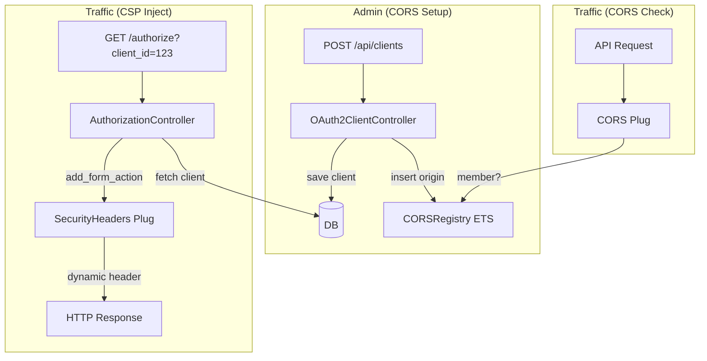

# Design Document — Auto CORS/CSP al Registrar Cliente

## Overview

Add automatic CORS origin registration when an OAuth2 client is created or updated, using an in-memory **ETS (Erlang Term Storage)** table. 
For CSP, dynamically inject the client's `redirect_uri` host into the `form-action` directive only during the OAuth2 authorization flow, ensuring O(1) performance and scaling to millions of clients without bloating the global HTTP headers.

### Key Design Decisions

1. **ETS para CORS en memoria** — Extremadamente rápido (`read_concurrency: true`), permite a múltiples peticiones HTTP validar CORS simultáneamente sin hacer cola (O(1)).
2. **CSP Dinámico (Per-Request)** — No existe un registro global para CSP. Se evita que la cabecera CSP crezca indefinidamente. El `SecurityHeaders` Plug mantiene una política segura por defecto.
3. **Inyección en Tiempo de Autorización** — El `AuthorizationController` lee el cliente que se intenta autorizar (búsqueda indexada súper rápida) e inyecta el host del `redirect_uri` en la cabecera CSP de esa única respuesta HTTP.

---

## Architecture



---

## Files Changed/Created

| File | Action | Description |
|------|--------|-------------|
| `lib/thalamus/application/cors_registry.ex` | **New** | GenServer + ETS CORS origin registry |
| `lib/thalamus_web/controllers/api/oauth2_client_controller.ex` | **Edit** | Call `CORSRegistry.add` after create + update |
| `lib/thalamus_web/plugs/cors.ex` | **Edit** | Validate against ETS dynamically |
| `lib/thalamus_web/plugs/security_headers.ex` | **Edit** | Add `add_form_action/2` to inject dynamic CSP |
| `lib/thalamus_web/controllers/oauth2/authorization_controller.ex` | **Edit** | Call `add_form_action/2` before rendering consent |
| `lib/thalamus/application.ex` | **Edit** | Start `CORSRegistry` + rebuild from DB on boot |

*(Note: CSPRegistry is explicitly discarded)*

---

## CORSRegistry (ETS)

```elixir
defmodule Thalamus.CORSRegistry do
  use GenServer
  
  @table_name :cors_origins

  def start_link(_opts) do
    GenServer.start_link(__MODULE__, :ok, name: __MODULE__)
  end

  def add(origin) when is_binary(origin) do
    :ets.insert(@table_name, {origin, true})
    :ok
  end

  def member?(origin) do
    case :ets.lookup(@table_name, origin) do
      [{^origin, true}] -> true
      [] -> false
    end
  end

  def all do
    :ets.tab2list(@table_name) |> Enum.map(fn {k, _v} -> k end)
  end

  def rebuild_from_clients do
    origins = load_origins_from_db()
    
    :ets.delete_all_objects(@table_name)
    entries = Enum.map(origins, &{&1, true})
    :ets.insert(@table_name, entries)
  end

  @impl true
  def init(:ok) do
    :ets.new(@table_name, [:set, :public, :named_table, read_concurrency: true])
    {:ok, %{}}
  end

  # ... privadas: load_origins_from_db, extract_origin
end
```

---

## Dynamic CSP Implementation

### 1. `SecurityHeaders` Plug

Se añade una función auxiliar para modificar la cabecera en vuelo:

```elixir
defmodule ThalamusWeb.Plugs.SecurityHeaders do
  # ... (resto del plug queda igual)

  def add_form_action(conn, host) do
    csp = Plug.Conn.get_resp_header(conn, "content-security-policy") |> List.first()
    
    if csp do
      # Agregamos los hosts al final de form-action
      new_csp = String.replace(csp, "form-action ", "form-action http://#{host}:* https://#{host}:* ")
      Plug.Conn.put_resp_header(conn, "content-security-policy", new_csp)
    else
      conn
    end
  end
end
```

### 2. `AuthorizationController`

Antes de mostrar la pantalla de consentimiento, extraemos el host del `redirect_uri` e inyectamos la cabecera CSP.

```elixir
# En render_consent_screen/2:

defp render_consent_screen(conn, data) do
  scope_strings = Enum.map(data.scopes, &scope_to_string/1)

  # NUEVO: CSP Dinámico
  host = extract_host(data.redirect_uri)
  conn = ThalamusWeb.Plugs.SecurityHeaders.add_form_action(conn, host)

  render(conn, :consent, ...)
end

defp extract_host(uri_str) do
  uri = URI.parse(uri_str)
  if uri.port && uri.port not in [80, 443], do: "#{uri.host}:#{uri.port}", else: uri.host
rescue
  _ -> nil
end
```

---

## Startup Rebuild

In `application.ex`:

```elixir
    opts = [strategy: :one_for_one, name: Thalamus.Supervisor]
    case Supervisor.start_link(children, opts) do
      {:ok, pid} ->
        Task.start(fn ->
          Thalamus.CORSRegistry.rebuild_from_clients()
        end)
        {:ok, pid}
      error -> error
    end
```
