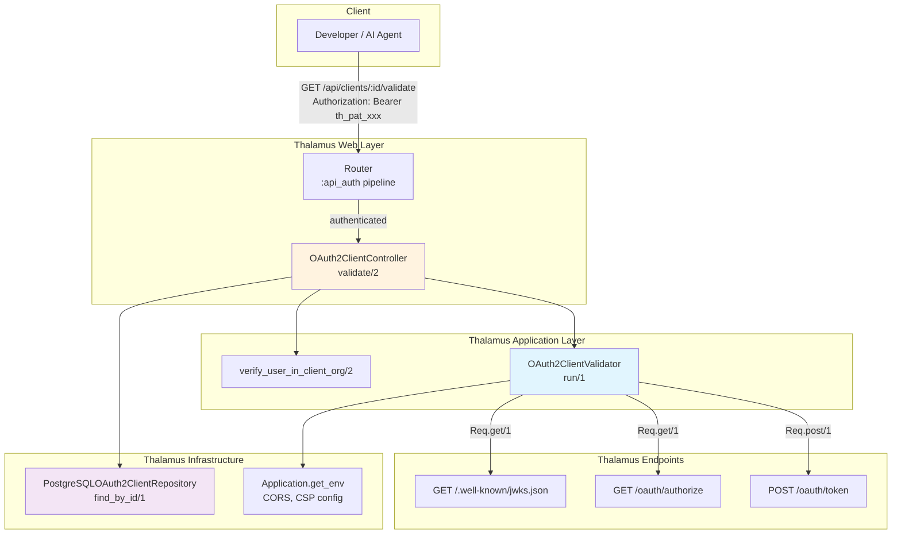
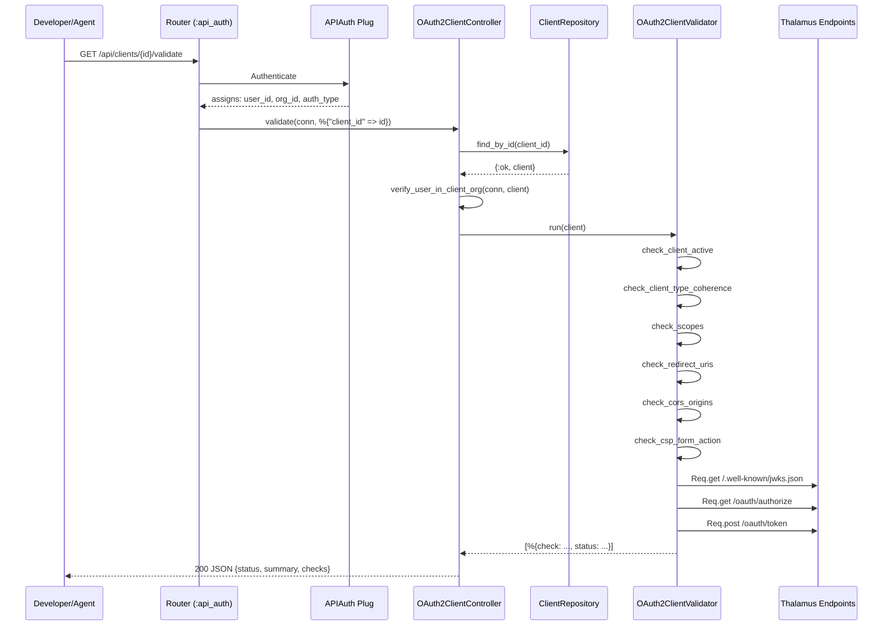

# Design Document — OAuth2 Client Validation Endpoint

## Overview

This design adds a diagnostic validation endpoint to the existing `OAuth2ClientController` in Thalamus. The implementation is read-only, requires no new database tables, and reuses the existing `:api_auth` authentication pipeline. A new `Thalamus.OAuth2ClientValidator` module encapsulates all validation logic as pure functions, following Clean Architecture principles (Application Layer, no side effects except internal HTTP health checks).

### Key Design Decisions

1. **Extend existing controller, don't create a new one** — `OAuth2ClientController` already handles `/api/clients` CRUD. Adding `validate/2` here keeps related logic together and reuses the existing `:api_auth` pipeline, `ClientId` value object parsing, and `client_to_json` formatting.

2. **Separate validator module** — `Thalamus.OAuth2ClientValidator` is a pure module in the Application layer. It receives an `OAuth2Client` entity and Thalamus runtime config, returns a list of check results. No database writes, no side effects. This makes it testable without mocks for most checks.

3. **Ownership check via organization membership** — The PAT already carries `organization_id` in assigns. JWT carries `user_id` which maps to organization memberships. API Keys have org-wide scope. The check extracts the client's organization and verifies the authenticated principal is a member.

4. **Health checks use Req (not curl)** — Internal endpoint health checks use the already-included `Req` library to make HTTP calls to Thalamus's own endpoints (`/.well-known/jwks.json`, `/oauth/authorize`, `POST /oauth/token`).

5. **No CSP/CORS external calls** — CORS configuration is read from `Application.get_env(:thalamus, ThalamusWeb.Plugs.CORS)` and CSP from `Application.get_env(:thalamus, ThalamusWeb.Plugs.SecurityHeaders)`. The validator reads these in-process, no HTTP calls needed for CORS/CSP checks.

---

## Architecture



---

## Files Changed/Created

| File | Action | Description |
|------|--------|-------------|
| `lib/thalamus_web/router.ex` | **Edit** | Add route `GET /clients/:client_id/validate` |
| `lib/thalamus_web/controllers/api/oauth2_client_controller.ex` | **Edit** | Add `validate/2` action + ownership check |
| `lib/thalamus/application/oauth2_client_validator.ex` | **New** | Validation logic module |
| `test/thalamus/application/oauth2_client_validator_test.exs` | **New** | Unit tests for validator |
| `test/thalamus_web/controllers/api/oauth2_client_controller_test.exs` | **Edit** | Add validate endpoint tests |

---

## Router Change

In `lib/thalamus_web/router.ex`, inside the existing `scope "/api", ThalamusWeb.API do pipe_through :api_auth` block (alongside the existing `resources "/clients"`):

```elixir
scope "/api", ThalamusWeb.API do
  pipe_through :api_auth

  resources "/clients", OAuth2ClientController, except: [:new, :edit]
  post "/clients/:client_id/rotate-secret", OAuth2ClientController, :rotate_secret
  post "/clients/:client_id/add-redirect-uri", OAuth2ClientController, :add_redirect_uri

  # NEW: OAuth2 client diagnostic validation
  get "/clients/:client_id/validate", OAuth2ClientController, :validate

  resources "/secrets", SecretController, only: [:index, :create, :delete]
end
```

---

## Controller Action: `validate/2`

```elixir
@doc """
GET /api/clients/:client_id/validate

Validate an OAuth2 client configuration. Returns a diagnostic report
with PASS/FAIL/WARN status for each check.

## Authorization
- PAT: user must be a member of the client's organization
- JWT: user must be a member of the client's organization
- API Key: allowed (admin/super_admin)

## Response
200 OK with validation report
"""
def validate(conn, %{"client_id" => id}) do
  with {:ok, client_id} <- ClientId.from_string(id),
       {:ok, client} <- PostgreSQLOAuth2ClientRepository.find_by_id(client_id),
       :ok <- verify_user_in_client_org(conn, client),
       checks <- Thalamus.OAuth2ClientValidator.run(client) do
    conn
    |> put_status(:ok)
    |> json(%{
      client_id: ClientId.to_string(client.id),
      client_name: client.name,
      organization_id: OrganizationId.to_string(client.organization_id),
      validated_at: DateTime.utc_now() |> DateTime.to_iso8601(),
      status: overall_status(checks),
      summary: count_statuses(checks),
      checks: checks
    })
  else
    {:error, :invalid_id} ->
      conn |> put_status(:bad_request) |> json(%{error: "Invalid client ID format"})

    {:error, :not_found} ->
      conn |> put_status(:not_found) |> json(%{error: "Client not found"})

    {:error, :forbidden} ->
      conn |> put_status(:forbidden) |> json(%{
        error: "Forbidden",
        detail: "You do not have access to this client's organization"
      })
  end
end
```

### Ownership Check

```elixir
defp verify_user_in_client_org(conn, client) do
  # API Keys have admin access to all orgs
  if conn.assigns[:auth_type] == :api_key do
    :ok
  else
    client_org_id = OrganizationId.to_string(client.organization_id)
    user_org_id = conn.assigns[:organization_id]

    # PAT assigns the organization_id directly
    # JWT assigns current_user with organization memberships
    cond do
      user_org_id && user_org_id == client_org_id ->
        :ok
      conn.assigns[:current_user] ->
        user_orgs = get_user_organization_ids(conn.assigns[:current_user])
        if client_org_id in user_orgs, do: :ok, else: {:error, :forbidden}
      true ->
        {:error, :forbidden}
    end
  end
end
```

---

## Validator Module: `Thalamus.OAuth2ClientValidator`

Location: `lib/thalamus/application/oauth2_client_validator.ex`

```elixir
defmodule Thalamus.OAuth2ClientValidator do
  @moduledoc """
  Validates an OAuth2 client configuration.

  Runs diagnostic checks on client coherence, CORS, CSP, and endpoint health.
  Pure functions — no database writes or side effects (except internal HTTP health checks).

  SOLID Principles:
  - Single Responsibility: Only validates OAuth2 client configuration
  - Open/Closed: New checks can be added by extending the checks list
  """

  alias Thalamus.Domain.Entities.OAuth2Client
  alias Thalamus.Domain.ValueObjects.{RedirectUri, Scope}

  @type check_result :: %{
    check: String.t(),
    status: String.t(),  # "pass" | "fail" | "warn"
    detail: String.t() | nil
  }

  @doc """
  Runs all validation checks on a client.

  Returns a list of check result maps.
  """
  @spec run(OAuth2Client.t()) :: [check_result()]
  def run(client) do
    # Run checks in sequence — each function may return 0-N check results
    [
      check_client_active(client),
      check_client_type_coherence(client),
      check_scopes(client),
      check_redirect_uris(client),
      check_cors_origins(client),
      check_csp_form_action(client),
      check_endpoint_health()
    ]
    |> List.flatten()
    |> Enum.reject(&is_nil/1)
  end

  # -- Private check functions --

  defp check_client_active(client) do
    if client.is_active do
      %{check: "client_active", status: "pass"}
    else
      %{check: "client_active", status: "fail",
        detail: "Client is deactivated. Activate it to allow OAuth2 flows."}
    end
  end

  defp check_client_type_coherence(client) do
    case client.client_type do
      :public -> check_spa_coherence(client)
      :confidential -> check_backend_coherence(client)
      :m2m -> check_backend_coherence(client)
      _ -> []
    end
  end

  defp check_spa_coherence(client) do
    [
      if(client.token_endpoint_auth_method != :none,
        do: %{check: "auth_method", status: "fail",
              detail: "SPA (client_type=public) must have token_endpoint_auth_method='none', current: '#{client.token_endpoint_auth_method}'"}
      ),
      if(!client.pkce_required,
        do: %{check: "pkce_required", status: "warn",
              detail: "SPA without PKCE is insecure. Set pkce_required: true"}
      ),
      if(!Enum.any?(client.grant_types, &(&1.type == :authorization_code)),
        do: %{check: "grant_types", status: "fail",
              detail: "SPA requires authorization_code grant type"}
      ),
      if(Enum.empty?(client.redirect_uris),
        do: %{check: "redirect_uris_present", status: "fail",
              detail: "SPA clients require at least one redirect URI"}
      )
    ]
  end

  defp check_backend_coherence(client) do
    [
      if(client.token_endpoint_auth_method != :client_secret_post,
        do: %{check: "auth_method", status: "warn",
              detail: "Backend normally uses client_secret_post, current: '#{client.token_endpoint_auth_method}'"}
      ),
      if(!Enum.any?(client.grant_types, &(&1.type == :client_credentials)),
        do: %{check: "grant_types", status: "warn",
              detail: "Backend normally uses client_credentials grant type"}
      )
    ]
  end

  defp check_scopes(client) do
    scope_strings = Enum.map(client.allowed_scopes, &Scope.to_string/1)
    if "openid" in scope_strings do
      %{check: "has_openid_scope", status: "pass"}
    else
      %{check: "has_openid_scope", status: "fail",
        detail: "openid scope is required for OpenID Connect. Add it to allowed_scopes."}
    end
  end

  defp check_redirect_uris(client) do
    client.redirect_uris
    |> Enum.map(fn uri ->
      uri_str = RedirectUri.to_string(uri)
      if String.starts_with?(uri_str, "http://") or String.starts_with?(uri_str, "https://") do
        nil  # valid, no individual pass needed
      else
        %{check: "redirect_uri_format", status: "fail",
          detail: "Invalid redirect URI format: #{uri_str}. Must start with http:// or https://"}
      end
    end)
  end

  defp check_cors_origins(client) do
    cors_config = Application.get_env(:thalamus, ThalamusWeb.Plugs.CORS, [])
    cors_origins = Keyword.get(cors_config, :origins, [])

    if cors_origins == [] do
      [%{check: "cors_origins", status: "warn",
         detail: "CORS_ORIGINS is not configured. Add origins to docker-compose.yml."}]
    else
      origins = extract_unique_origins(client.redirect_uris) |> Enum.map(&to_string/1)
      origins
      |> Enum.map(fn origin ->
        origin_str = to_string(origin)
        if origin_str in cors_origins do
          nil
        else
          %{check: "cors_origins", status: "fail",
            detail: "Origin '#{origin_str}' is not in CORS_ORIGINS. Add it to CORS_ORIGINS in docker-compose.yml."}
        end
      end)
    end
  end

  defp check_csp_form_action(client) do
    csp_config = Application.get_env(:thalamus, ThalamusWeb.Plugs.SecurityHeaders, [])
    csp_policy = Keyword.get(csp_config, :csp_policy, "")

    if csp_policy == "" do
      [%{check: "csp_policy", status: "fail",
         detail: "CSP policy not configured. Check config/config.exs and security_headers.ex."}]
    else
      # Extract form-action hosts from CSP
      form_action = extract_form_action(csp_policy)
      origins = extract_unique_origins(client.redirect_uris)

      origins
      |> Enum.map(fn origin ->
        host = extract_host(origin)
        if csp_covers_host?(form_action, host) do
          nil
        else
          %{check: "csp_form_action", status: "warn",
            detail: "Domain '#{host}' is not covered by CSP form-action. Add to form-action in config/config.exs AND security_headers.ex."}
        end
      end)
    end
  end

  defp check_endpoint_health do
    base_url = Application.get_env(:thalamus, :base_url, "http://localhost:4000")

    [
      check_jwks(base_url),
      check_authorize_endpoint(base_url),
      check_token_endpoint(base_url)
    ]
  end

  defp check_jwks(base_url) do
    case Req.get("#{base_url}/.well-known/jwks.json") do
      {:ok, %{status: 200}} ->
        %{check: "jwks_endpoint", status: "pass"}
      {:ok, %{status: status}} ->
        %{check: "jwks_endpoint", status: "fail",
          detail: "JWKS endpoint returned HTTP #{status}"}
      {:error, reason} ->
        %{check: "jwks_endpoint", status: "fail",
          detail: "JWKS endpoint unreachable: #{inspect(reason)}"}
    end
  end

  defp check_authorize_endpoint(base_url) do
    case Req.get("#{base_url}/oauth/authorize") do
      {:ok, %{status: s}} when s in [200, 302, 400] ->
        %{check: "authorize_endpoint", status: "pass"}
      {:ok, %{status: status}} ->
        %{check: "authorize_endpoint", status: "fail",
          detail: "Authorize endpoint returned HTTP #{status}"}
      {:error, reason} ->
        %{check: "authorize_endpoint", status: "fail",
          detail: "Authorize endpoint unreachable: #{inspect(reason)}"}
    end
  end

  defp check_token_endpoint(base_url) do
    case Req.post("#{base_url}/oauth/token", json: %{}) do
      {:ok, %{status: s}} when s in [400, 401] ->
        %{check: "token_endpoint", status: "pass"}
      {:ok, %{status: status}} ->
        %{check: "token_endpoint", status: "fail",
          detail: "Token endpoint returned HTTP #{status}"}
      {:error, reason} ->
        %{check: "token_endpoint", status: "fail",
          detail: "Token endpoint unreachable: #{inspect(reason)}"}
    end
  end

  # -- Helper functions --

  defp extract_unique_origins(redirect_uris) do
    redirect_uris
    |> Enum.map(&RedirectUri.to_string/1)
    |> Enum.map(fn uri ->
      uri_str = to_string(uri)
      %URI{URI.parse(uri_str) | path: nil, query: nil, fragment: nil}
      |> URI.to_string()
      |> String.replace_suffix("/", "")
    end)
    |> Enum.uniq()
  end

  defp extract_host(origin) do
    uri = URI.parse(to_string(origin))
    if uri.port && uri.port not in [80, 443] do
      "#{uri.host}:#{uri.port}"
    else
      uri.host
    end
  end

  defp extract_form_action(csp_policy) do
    case Regex.run(~r/form-action\s+([^;]+)/, csp_policy) do
      [_, form_action] -> form_action |> String.trim()
      nil -> ""
    end
  end

  defp csp_covers_host?(form_action, host) do
    # Check exact match
    if String.contains?(form_action, host) do
      true
    else
      # Check wildcard: *.domain.com covers sub.domain.com
      domain_part = host |> String.split(".") |> Enum.drop(1) |> Enum.join(".")
      String.contains?(form_action, "*.#{domain_part}")
    end
  end

  # -- Response helpers used by the controller --

  @doc false
  def overall_status(checks) do
    cond do
      Enum.any?(checks, &(&1.status == "fail")) -> "invalid"
      Enum.any?(checks, &(&1.status == "warn")) -> "warning"
      true -> "valid"
    end
  end

  @doc false
  def count_statuses(checks) do
    %{
      pass: Enum.count(checks, &(&1.status == "pass")),
      fail: Enum.count(checks, &(&1.status == "fail")),
      warn: Enum.count(checks, &(&1.status == "warn"))
    }
  end
end
```

---

## Endpoint Specification

### `GET /api/clients/:client_id/validate`

**Auth:** `Authorization: Bearer <token>` (PAT or JWT) or `Authorization: ApiKey <key>`

**Path Parameters:**

| Param | Type | Required | Description |
|-------|------|----------|-------------|
| `client_id` | UUID | Yes | Client UUID (not client_id_string) |

**Response 200 — Valid:**

```json
{
  "client_id": "ea7b11ea-852c-44e5-aee1-a761ec76eaea",
  "client_name": "ZEA Platform",
  "organization_id": "ea7b11ea-852c-44e5-aee1-a761ec76eaea",
  "validated_at": "2026-06-23T15:30:00Z",
  "status": "valid",
  "summary": {"pass": 10, "fail": 0, "warn": 0},
  "checks": [
    {"check": "client_active", "status": "pass"},
    {"check": "auth_method", "status": "pass"},
    {"check": "pkce_required", "status": "pass"},
    {"check": "grant_types", "status": "pass"},
    {"check": "has_openid_scope", "status": "pass"},
    {"check": "cors_origins", "status": "pass"},
    {"check": "csp_form_action", "status": "pass"},
    {"check": "jwks_endpoint", "status": "pass"},
    {"check": "authorize_endpoint", "status": "pass"},
    {"check": "token_endpoint", "status": "pass"}
  ]
}
```

**Response 200 — Invalid (mix of pass/fail/warn):**

```json
{
  "client_id": "c0000001-852c-44e5-aee1-a761ec76eaea",
  "client_name": "Soma — Agent Hub",
  "organization_id": "ea7b11ea-852c-44e5-aee1-a761ec76eaea",
  "validated_at": "2026-06-23T15:30:00Z",
  "status": "invalid",
  "summary": {"pass": 6, "fail": 2, "warn": 1},
  "checks": [
    {"check": "client_active", "status": "pass"},
    {"check": "auth_method", "status": "pass"},
    {"check": "pkce_required", "status": "pass"},
    {"check": "grant_types", "status": "pass"},
    {"check": "has_openid_scope", "status": "pass"},
    {"check": "cors_origins", "status": "fail", "detail": "Origin 'http://soma.zea.localhost' is not in CORS_ORIGINS. Add it to CORS_ORIGINS in docker-compose.yml."},
    {"check": "cors_origins", "status": "fail", "detail": "Origin 'https://soma.zea.cl' is not in CORS_ORIGINS. Add it to CORS_ORIGINS in docker-compose.yml."},
    {"check": "csp_form_action", "status": "warn", "detail": "Domain 'soma.zea.cl' is not covered by CSP form-action. Add to form-action in config/config.exs AND security_headers.ex."},
    {"check": "jwks_endpoint", "status": "pass"},
    {"check": "authorize_endpoint", "status": "pass"},
    {"check": "token_endpoint", "status": "pass"}
  ]
}
```

**Response 400 — Invalid client ID format:**

```json
{"error": "Invalid client ID format"}
```

**Response 401 — Unauthorized:**

```json
{"error": "Missing or invalid Authorization header. Use 'Bearer <jwt>', 'Bearer <th_pat_...>' or 'ApiKey <key>'"}
```

**Response 403 — Forbidden (wrong organization):**

```json
{"error": "Forbidden", "detail": "You do not have access to this client's organization"}
```

**Response 404 — Client not found:**

```json
{"error": "Client not found"}
```

---

## Data Flow



---

## Error Handling Strategy

| Scenario | Result | HTTP Status |
|----------|--------|-------------|
| Missing/invalid Auth header | APIAuth plug halts | 401 |
| Token expired or revoked | APIAuth plug halts | 401 |
| Invalid client_id format (not UUID) | Controller error | 400 |
| Client not found in DB | Controller error | 404 |
| User not in client's org | Controller error | 403 |
| Internal HTTP call to Thalamus fails | Individual check FAIL, other checks continue | 200 |
| CORS_ORIGINS env not set | CORS check WARNS, other checks continue | 200 |
| CSP not configured | CSP check FAILS, other checks continue | 200 |

---

## Testing Strategy

### Unit Tests — `OAuth2ClientValidator`

- Test each check function in isolation
- Stub `Application.get_env` for CORS/CSP config
- Stub `Req` for endpoint health checks using Mox
- Test edge cases: empty redirect URIs, mixed schemas, duplicate origins, invalid URIs
- Test `overall_status/1` and `count_statuses/1` with various check combinations

### Controller Tests — `OAuth2ClientController`

- Test with valid PAT → 200 with checks
- Test with valid JWT → 200 with checks
- Test with valid API Key → 200 with checks
- Test with PAT from wrong org → 403
- Test without auth → 401
- Test with invalid UUID → 400
- Test with non-existent client → 404
- Test with inactive client → 200 with client_active: fail
- Assert JSON response structure matches spec

### Integration Tests

- End-to-end: create a PAT, call validate endpoint against a real seeded client, verify response contains expected checks
